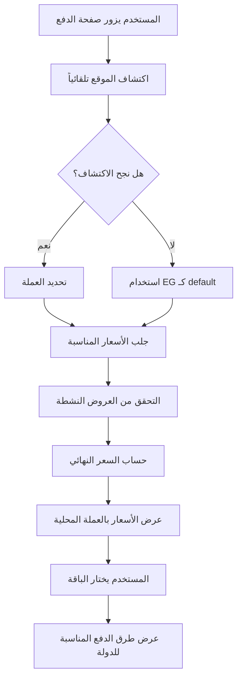

# 📊 نظام التسعير - الدليل الشامل

## 🎯 نظرة عامة

نظام تسعير ذكي يكتشف موقع المستخدم تلقائياً ويعرض الأسعار بعملة بلده، مع دعم عروض ترويجية وخصومات مختلفة حسب الدولة ونوع الحساب.

---

## 💳 هيكل التسعير الحالي

### 1️⃣ حسابات اللاعبين (Players)

#### 🇪🇬 مصر (بالجنيه المصري - EGP)

| الباقة | السعر الأصلي | السعر بعد الخصم 50% | المدة |
|--------|--------------|---------------------|-------|
| ثلاثة أشهر | 240 ج.م | **120 ج.م** | 90 يوم |
| ستة أشهر | 300 ج.م | **150 ج.م** | 180 يوم |
| سنة واحدة | 360 ج.م | **180 ج.م** | 365 يوم |

**ملاحظة:** جميع الباقات المصرية تحمل خصم 50%

#### 🌍 جميع الدول الأخرى (بالدولار - USD)

| الباقة | السعر الأصلي | السعر بعد الخصم 50% | المدة |
|--------|--------------|---------------------|-------|
| ثلاثة أشهر | $40 | **$20** | 90 يوم |
| ستة أشهر | $70 | **$35** | 180 يوم |
| سنة واحدة | $100 | **$50** | 365 يوم |

**ملاحظة:** جميع الباقات الدولية تحمل خصم 50%

---

### 2️⃣ أنواع الحسابات الأخرى

| نوع الحساب | الحالة | الملاحظات |
|-----------|--------|-----------|
| **الأندية (Clubs)** | 🔄 قيد الدراسة | تسعير وميزات منفصلة |
| **الأكاديميات (Academies)** | 🔄 قيد الدراسة | تسعير وميزات منفصلة |
| **المدربين (Trainers)** | 🔄 قيد الدراسة | تسعير وميزات منفصلة |
| **الوكلاء (Agents)** | 🔄 قيد الدراسة | تسعير وميزات منفصلة |

---

## 🧠 اللوجيك المقترح

### المرحلة 1: اكتشاف الموقع والعملة

```typescript
// 1. اكتشاف دولة المستخدم تلقائياً
async function detectUserLocation() {
  try {
    // محاولة 1: Geolocation API
    const position = await getCurrentPosition();
    const countryCode = await reverseGeocode(position.coords);
    
    // محاولة 2: IP Geolocation (fallback)
    if (!countryCode) {
      const ipData = await fetch('https://ipapi.co/json/');
      countryCode = ipData.country_code;
    }
    
    // محاولة 3: Default (مصر للمنطقة العربية)
    return countryCode || 'EG';
  } catch (error) {
    return 'EG'; // Default
  }
}

// 2. تحديد العملة بناءً على الدولة
function getCurrencyByCountry(countryCode: string): string {
  const currencyMap = {
    'EG': 'EGP',
    'SA': 'SAR',
    'AE': 'AED',
    'KW': 'KWD',
    // ... باقي الدول
  };
  return currencyMap[countryCode] || 'USD';
}
```

---

### المرحلة 2: جلب الأسعار المناسبة

```typescript
interface PricingParams {
  accountType: 'player' | 'club' | 'academy' | 'trainer' | 'agent';
  countryCode: string;
  planKey: '3months' | '6months' | '1year';
  playerCount?: number; // للدفع الجماعي
}

async function getFinalPrice(params: PricingParams) {
  // 1. جلب السعر الأساسي
  const basePlan = await getBasePlan(params.planKey);
  
  // 2. التحقق من التخصيصات حسب الدولة
  const countryOverride = await getPricingOverride({
    countryCode: params.countryCode,
    planKey: params.planKey,
    accountType: params.accountType
  });
  
  // 3. التحقق من العروض الترويجية النشطة
  const activeOffers = await getActiveOffers({
    countryCode: params.countryCode,
    planKey: params.planKey,
    accountType: params.accountType
  });
  
  // 4. حساب السعر النهائي
  let finalPrice = countryOverride?.price || basePlan.basePrice;
  let currency = countryOverride?.currency || basePlan.currency;
  
  // تطبيق الخصومات
  activeOffers.forEach(offer => {
    if (offer.discountType === 'percentage') {
      finalPrice = finalPrice * (1 - offer.discountValue / 100);
    } else {
      finalPrice = finalPrice - offer.discountValue;
    }
  });
  
  // 5. خصم جماعي (إذا كان هناك أكثر من لاعب)
  if (params.playerCount && params.playerCount > 1) {
    const bulkDiscount = calculateBulkDiscount(params.playerCount);
    finalPrice = finalPrice * params.playerCount * (1 - bulkDiscount);
  }
  
  return {
    finalPrice,
    currency,
    originalPrice: basePlan.basePrice,
    appliedDiscounts: activeOffers,
    savings: (basePlan.basePrice - finalPrice)
  };
}
```

---

## 📦 هيكل قاعدة البيانات المقترح

### Collection: `subscription_plans`

```typescript
{
  id: "plan_3months_player",
  name: "ثلاثة أشهر",
  key: "3months",
  accountType: "player",
  basePrice: 40, // السعر الأساسي بالدولار
  currency: "USD",
  duration: 90, // بالأيام
  features: [
    { name: "عدد لاعبين غير محدود", included: true },
    { name: "تتبع الأداء", included: true },
    { name: "الملف الشخصي العام", included: true },
    { name: "البحث عن الفرص", included: true }
  ],
  bonusFeatures: [
    { name: "دعم فني عبر البريد", included: true }
  ],
  isActive: true,
  displayOrder: 1
}
```

### Collection: `pricing_overrides`

```typescript
{
  id: "override_egypt_3months",
  countryCode: "EG",
  planKey: "3months",
  accountType: "player",
  price: 240, // السعر المخصص
  currency: "EGP",
  isActive: true,
  effectiveFrom: "2024-01-01",
  effectiveTo: null // دائم
}
```

### Collection: `promotional_offers`

```typescript
{
  id: "offer_launch_50_egypt",
  name: "عرض الإطلاق - مصر",
  description: "خصم 50% على جميع الباقات",
  code: "LAUNCH50EG",
  offerType: "launch",
  applicablePlans: ["3months", "6months", "1year"],
  applicableCountries: ["EG"],
  applicableAccountTypes: ["player"],
  discountType: "percentage",
  discountValue: 50,
  startDate: "2024-01-01",
  endDate: "2024-12-31",
  status: "active",
  usageLimit: null, // غير محدود
  usageCount: 0
}
```

---

## 🎯 الميزات حسب نوع الحساب

### اللاعبين (Players) - الوضع الحالي ✅

```typescript
const playerFeatures = {
  basic: [
    "إنشاء ملف شخصي احترافي",
    "البحث عن الفرص (أندية، أكاديميات)",
    "عرض الملف الشخصي للمدربين والأندية",
    "تتبع الإحصائيات الأساسية",
    "التواصل مع الأندية",
  ],
  bonus: [
    "دعم فني عبر البريد الإلكتروني",
    "تحديثات شهرية عن الفرص",
  ]
};
```

### الأندية (Clubs) - مقترح 🔄

```typescript
const clubFeatures = {
  pricing: {
    monthly: { price: 200, currency: "USD", eg_price: 4000, eg_currency: "EGP" },
    quarterly: { price: 500, currency: "USD", eg_price: 10000, eg_currency: "EGP" },
    yearly: { price: 1500, currency: "USD", eg_price: 30000, eg_currency: "EGP" }
  },
  features: [
    "عدد لاعبين غير محدود",
    "إدارة متكاملة للفريق",
    "نظام تتبع الأداء",
    "تقارير وإحصائيات متقدمة",
    "نظام الحضور والغياب",
    "تسجيل الفيديوهات والتحليل",
    "التواصل مع اللاعبين والأهالي",
    "البحث عن لاعبين جدد",
  ],
  bonus: [
    "دعم فني ذو أولوية",
    "استشارات إدارية شهرية",
    "تدريب مجاني للطاقم",
  ]
};
```

### الأكاديميات (Academies) - مقترح 🔄

```typescript
const academyFeatures = {
  pricing: {
    monthly: { price: 150, currency: "USD", eg_price: 3000, eg_currency: "EGP" },
    quarterly: { price: 400, currency: "USD", eg_price: 8000, eg_currency: "EGP" },
    yearly: { price: 1200, currency: "USD", eg_price: 24000, eg_currency: "EGP" }
  },
  features: [
    "إدارة اللاعبين والمستويات",
    "جدولة التدريبات",
    "نظام الحضور والغياب",
    "تتبع التطور والأداء",
    "التواصل مع الأهالي",
    "إدارة المدفوعات",
    "تقارير شهرية للأهالي",
  ],
  bonus: [
    "دعم فني",
    "استشارات تعليمية",
  ]
};
```

### المدربين (Trainers) - مقترح 🔄

```typescript
const trainerFeatures = {
  pricing: {
    monthly: { price: 30, currency: "USD", eg_price: 600, eg_currency: "EGP" },
    quarterly: { price: 75, currency: "USD", eg_price: 1500, eg_currency: "EGP" },
    yearly: { price: 200, currency: "USD", eg_price: 4000, eg_currency: "EGP" }
  },
  features: [
    "ملف تعريفي احترافي",
    "عرض الخبرات والشهادات",
    "إدارة جلسات التدريب",
    "البحث عن لاعبين",
    "التواصل مع الأندية والأكاديميات",
  ],
  bonus: [
    "دعم فني",
  ]
};
```

---

## 🔄 سير العمل (Workflow)



---

## 💰 حساب الخصومات

### 1. الخصومات حسب النوع

```typescript
function calculateDiscount(params: {
  basePrice: number;
  discountType: 'percentage' | 'fixed';
  discountValue: number;
}) {
  if (params.discountType === 'percentage') {
    return params.basePrice * (params.discountValue / 100);
  }
  return Math.min(params.discountValue, params.basePrice);
}
```

### 2. الخصومات الجماعية (Bulk Discount)

```typescript
function calculateBulkDiscount(playerCount: number): number {
  if (playerCount >= 20) return 0.20; // 20% خصم
  if (playerCount >= 10) return 0.15; // 15% خصم
  if (playerCount >= 5) return 0.10;  // 10% خصم
  return 0; // بدون خصم
}
```

### 3. الترقية (Upgrade)

```typescript
function calculateUpgradePrice(params: {
  currentPlan: string;
  newPlan: string;
  remainingDays: number;
}) {
  const currentValue = (params.currentPlan.price / params.currentPlan.duration) * params.remainingDays;
  const newPrice = params.newPlan.price;
  return Math.max(0, newPrice - currentValue);
}
```

---

## 🌍 دعم العملات

### العملات المدعومة حالياً:

```typescript
const SUPPORTED_CURRENCIES = {
  EGP: { symbol: 'ج.م', name: 'جنيه مصري', countries: ['EG'] },
  USD: { symbol: '$', name: 'دولار أمريكي', countries: ['default'] },
  SAR: { symbol: 'ر.س', name: 'ريال سعودي', countries: ['SA'] },
  AED: { symbol: 'د.إ', name: 'درهم إماراتي', countries: ['AE'] },
  KWD: { symbol: 'د.ك', name: 'دينار كويتي', countries: ['KW'] },
  // ... إلخ
};
```

---

## 📱 طرق الدفع حسب الدولة

### 🇪🇬 مصر

```typescript
const egyptPaymentMethods = [
  { id: 'geidea', name: 'بطاقة بنكية', icon: '💳' },
  { id: 'vodafone_cash', name: 'فودافون كاش', icon: '📱' },
  { id: 'etisalat_cash', name: 'اتصالات كاش', icon: '💰' },
  { id: 'orange_money', name: 'أورانج موني', icon: '🧡' },
  { id: 'instapay', name: 'انستاباي', icon: '⚡' },
  { id: 'bank_transfer', name: 'تحويل بنكي', icon: '🏦' },
];
```

### 🇸🇦 السعودية

```typescript
const saudiPaymentMethods = [
  { id: 'geidea', name: 'بطاقة بنكية', icon: '💳' },
  { id: 'stc_pay', name: 'STC Pay', icon: '📱' },
  { id: 'bank_transfer', name: 'تحويل بنكي', icon: '🏦' },
];
```

### 🌍 عالمي

```typescript
const globalPaymentMethods = [
  { id: 'geidea', name: 'بطاقة بنكية', icon: '💳' },
  { id: 'paypal', name: 'PayPal', icon: '💙' },
  { id: 'bank_transfer', name: 'تحويل بنكي', icon: '🏦' },
];
```

---

## 🎁 أمثلة على العروض الترويجية

### 1. عرض الإطلاق (Launch Offer)

```typescript
{
  name: "عرض الإطلاق - خصم 50%",
  type: "launch",
  discount: { type: "percentage", value: 50 },
  countries: ["EG"],
  plans: ["3months", "6months", "1year"],
  validUntil: "2024-12-31"
}
```

### 2. عرض موسمي (Seasonal)

```typescript
{
  name: "عرض رمضان - خصم 30%",
  type: "seasonal",
  discount: { type: "percentage", value: 30 },
  countries: ["EG", "SA", "AE"],
  plans: ["all"],
  validFrom: "2024-03-01",
  validUntil: "2024-03-30"
}
```

### 3. عرض الإحالة (Referral)

```typescript
{
  name: "عرض صديق - خصم 10 دولار",
  type: "referral",
  discount: { type: "fixed", value: 10 },
  countries: ["all"],
  requiresCode: true,
  oneTimeUse: true
}
```

---

## 🚀 خطة التنفيذ

### المرحلة 1: الإصلاحات العاجلة ✅
- [x] إصلاح اكتشاف الموقع
- [x] إصلاح تحويل العملات
- [x] دعم العروض الترويجية

### المرحلة 2: تحسين التسعير 🔄
- [ ] إنشاء pricing_overrides لمصر
- [ ] إضافة العروض الترويجية النشطة
- [ ] تطبيق الخصومات الجماعية

### المرحلة 3: أنواع الحسابات الأخرى ⏳
- [ ] تحديد تسعير الأندية
- [ ] تحديد تسعير الأكاديميات
- [ ] تحديد تسعير المدربين
- [ ] تحديد تسعير الوكلاء

---

## 📊 ملخص الأسعار الحالية

| الباقة | مصر (EGP) | دولي (USD) | المدة | الخصم |
|--------|----------|-----------|-------|------|
| 3 أشهر | 120 ج.م | $20 | 90 يوم | 50% |
| 6 أشهر | 150 ج.م | $35 | 180 يوم | 50% |
| سنة | 180 ج.م | $50 | 365 يوم | 50% |

---

**آخر تحديث:** 15 ديسمبر 2024
**الحالة:** ✅ جاهز للتطبيق
