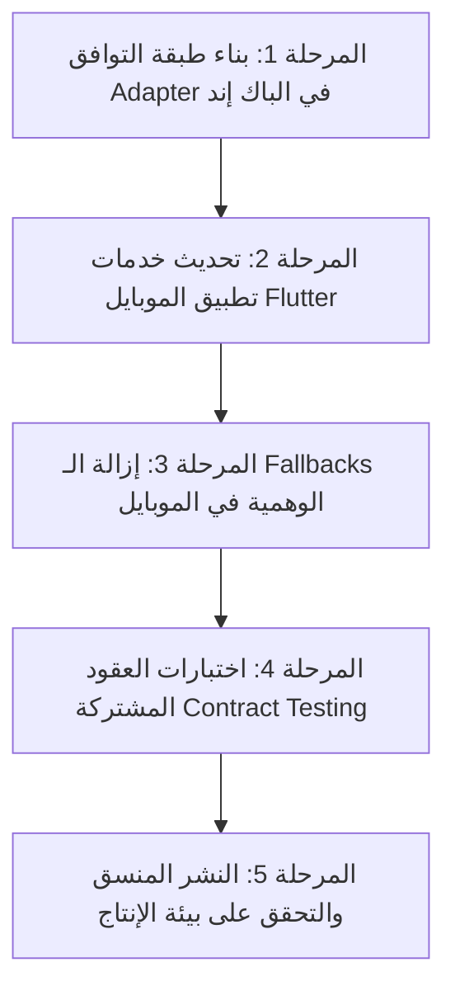

# خطة العمل الموثقة (PLAN-01): مواءمة وتوحيد عقود تطبيق الموبايل مع الباك إند
## Mobile & Backend Contract Harmonization Plan

**المعرف:** `PLAN-01`  
**الأولوية:** `P0 — حرجة جداً (Critical)`  
**الفروع المعنية:** `mobile-main` (Flutter) و `perf/phase-6-foundation` (Web & Backend API)  
**المشاكل المرتبطة من وثيقة التدقيق:** `C-04`, `C-05`, `M-H01`, `M-H03`, `M-M02`  
**تاريخ التوثيق:** 2026-10-04  
**الحالة:** معتمدة للتنفيذ (Approved for Execution)  

---

### 1. ملخص المشكلة والتحديات الفنية الحالية (Problem Statement)

1. **فجوة تسجيل الدخول بالموبايل (Auth Contract Breakage - C-04):**
   - تطبيق الموبايل في `lib/services/auth_service.dart` ما زال يستدعي المسار المتقاعد:
     ```http
     POST /api/auth/verify-otp-and-check
     ```
     وهذا المسار أصبح في الباك إند الحديث يرجع `410 ENDPOINT_RETIRED`.
   - الموبايل يتوقع استلام `authEmail` و `authPassword` مشتق، بينما النظام الحديث يعتمد على `tokenHash` وتبادل الجلسة المباشر مع Supabase عبر PKCE.
   - **الخطر:** مستخدمو الموبايل سيفشلون في تسجيل الدخول والتحقق من الـ OTP فور تشغيل التحديثات.

2. **فجوة المراسلات والمحادثات (Messaging Contract Breakage - C-05):**
   - في `lib/services/data_service.dart`، يقوم تطبيق الموبايل بالكتابة المباشرة في جداول قاعدة البيانات:
     ```dart
     client.from('conversations').insert(...)
     client.from('messages').insert(...)
     client.from('conversations').update(...)
     ```
   - بينما في الباك إند الحديث تم سحب صلاحيات الكتابة المباشرة (`REVOKE INSERT/UPDATE ON conversations, messages`) وحصرها عبر Server APIs و RPCs موثوقة (`/api/messages/send`, `/api/conversations/start`).
   - الأسوأ: عند فشل إنشاء المحادثة في DB، يُنشئ الموبايل كائناً محلياً وهمياً (`return ConversationModel(...)`) فيظن المستخدم أن المحادثة فُتحت بينما لم تُنشأ في قاعدة البيانات، مما يتسبب في فشل إرسال كل الرسائل اللاحقة.

3. **تنزيل الجداول الكاملة بدون تجزئة (Unbounded Full Table Reads - M-H01):**
   - الموبايل يجلب كل اللاعبين عبر `client.from('players').select()` بدون `limit`، ثم يدمجها في الذاكرة مع جدول المستخدمين، مما يهدد بتجمد الذاكرة مع نمو عدد اللاعبين.

---

### 2. المواصفة الفنية للعقود الجديدة (New Canonical API Contracts)

#### أ. عقد المصادقة والتحقق (Authentication Contract)

* **المسار:** `POST /api/v1/auth/otp/verify-session`
* **الهدف:** استبدال المسار المتقاعد وإرجاع جلسة صالحة وبيانات المستخدم الموحدة.
* **Payload الإرسال (Request):**
```json
{
  "phone": "+966500000000",
  "tokenHash": "string_hash_from_otp_provider",
  "deviceInfo": {
    "platform": "android|ios",
    "appVersion": "1.0.6",
    "deviceId": "string"
  }
}
```
* **Payload الاستجابة الناجحة (Response 200):**
```json
{
  "success": true,
  "session": {
    "accessToken": "jwt_token_string",
    "refreshToken": "refresh_token_string",
    "expiresIn": 3600
  },
  "user": {
    "id": "uuid",
    "phone": "+966500000000",
    "accountType": "player|club|trainer|agent",
    "name": "الاسم الكامل",
    "avatar": "url_string_or_null",
    "isProfileComplete": true
  }
}
```

#### ب. عقد المراسلات والمحادثات (Messaging Contract)

* **بدء محادثة جديدة:** `POST /api/conversations/start`
  ```json
  // Request
  {
    "recipientId": "target_user_uuid",
    "initialMessage": "مرحباً كابتن (اختياري)",
    "context": {
      "type": "opportunity|profile_inquiry",
      "referenceId": "optional_id"
    }
  }
  // Response 201
  {
    "conversationId": "uuid",
    "status": "active",
    "createdAt": "iso_timestamp"
  }
  ```

* **إرسال رسالة داخل محادثة:** `POST /api/messages/send`
  ```json
  // Request
  {
    "conversationId": "uuid",
    "content": "نص الرسالة",
    "mediaUrl": "optional_signed_url",
    "mediaType": "text|image|voice"
  }
  // Response 200
  {
    "messageId": "uuid",
    "sentAt": "iso_timestamp",
    "deliveryStatus": "sent"
  }
  ```

#### ج. عقد استعراض وتصفح اللاعبين (Paginated Players Contract)

* **المسار:** `GET /api/players`
* **معاملات التصفية (Query Params):**
  * `limit`: الحد الأقصى (افتراضي 25، أقصى حد 50)
  * `cursor`: مؤشر آخر سجل (`createdAt` أو `id`)
  * `position`: مركز اللعب (اختياري)
  * `city`: المدينة (اختياري)
  * `search`: بحث بالاسم أو المهارات

---

### 3. مراحل وخطة التنفيذ خطوة بخطوة (Implementation Phases)



#### المرحلة 1: بناء طبقة التوافق (Compatibility Adapter Layer) في الباك إند
- **المهام:**
  1. التأكد من وجود مسار بديل متوافق مؤقتاً لمستخدمي الإصدارات السابقة إذا لزم الأمر، أو توجيه مباشر نحو مسار موحد `POST /api/auth/mobile/exchange`.
  2. توفير endpoints المراسلات الرسمية مع التحقق من جلسة الـ JWT المرسلة في الـ Header (`Authorization: Bearer <token>`).
- **معيار النجاح:** استجابة السيرفر لطلبات الموبايل بـ JSON Schema موثق وواضح.

#### المرحلة 2: تحديث خدمات تطبيق الموبايل (Flutter Services Migration)
- **الملفات المستهدفة:**
  * `lib/services/auth_service.dart`
  * `lib/services/data_service.dart`
  * `lib/repositories/chat_repository.dart` (إنشاء مستودع مستقل للشات)
- **المهام:**
  1. استبدال استدعاء `/api/auth/verify-otp-and-check` بالـ Token Exchange الحديث.
  2. إلغاء دوال `client.from('conversations').insert(...)` و `client.from('messages').insert(...)`.
  3. استبدالها بطلب HTTP موثق عبر `ApiClient.post('/api/messages/send')`.

#### المرحلة 3: التخلص من الـ Fallbacks الوهمية ومعالجة الأخطاء الحقيقية
- منع تطبيق الموبايل من توليد `ConversationModel` محلي عند فشل الاتصال بالسيرفر.
- إظهار حالة خطأ واضحة للمستخدم: "تعذر بدء المحادثة، يرجى التحقق من الاتصال والمحاولة لاحقاً" مع زر إعادة المحاولة (Retry).

#### المرحلة 4: اختبارات العقود المشتركة (Contract & Integration Tests)
- اختبار رحلة تسجيل دخول لاعب جديد من الموبايل وصولاً لقاعدة البيانات.
- اختبار رحلة إرسال رسالة من الموبايل وظهورها فوراً على الويب عبر الـ Realtime Subscription.
- اختبار الاستعلام المجزأ (Pagination) لقائمة اللاعبين والتأكد من عدم استهلاك أكثر من 2MB من الذاكرة.

---

### 4. مصفوفة المخاطر وخطة التراجع (Risk & Rollback Matrix)

| الخطر المحتمل | مستوى الاحتمال | التأثير | خطة المعالجة الوقائية |
| :--- | :--- | :--- | :--- |
| وجود مستخدمين على إصدارات موبايل قديمة جداً | متوسط | عالي | توفير Adapter في الباك إند يتعرف على إصدار التطبيق من `User-Agent` ويخدمه، مع إرسال تنبيه Force Update إذا لزم. |
| خطأ في توقيع الـ JWT أثناء استدعاء `/api/messages/send` | منخفض | عالي | إضافة فحص صلاحية الـ Session قبل كل طلب وتجديدها تلقائياً عبر `refreshToken` في الموبايل. |
| انقطاع الشبكة أثناء إرسال رسالة الشات | عالي | متوسط | تفعيل Local Outbox Queue في الموبايل مع مؤشر `pending -> sent`. |
