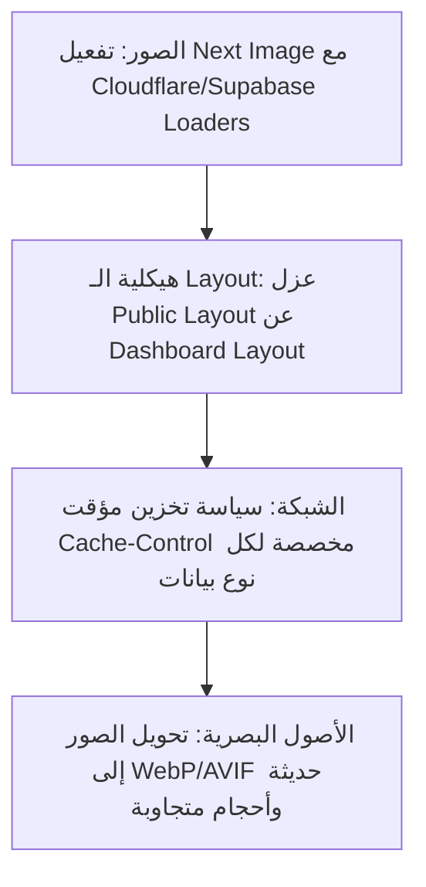

# خطة العمل الموثقة (PLAN-02): تحسين أداء الويب والوسائط ومؤشرات Core Web Vitals
## Web Performance, Media & Core Web Vitals Optimization Plan

**المعرف:** `PLAN-02`  
**الأولوية:** `P1 — عالية جداً وتأثير مباشر على السرعة (High/Speed)`  
**الفروع المعنية:** `perf/phase-6-foundation` (Web)  
**المشاكل المرتبطة من وثيقة التدقيق:** `H-01`, `H-02`, `H-03`, `H-04`, `H-09`, `H-10`  
**تاريخ التوثيق:** 2026-10-04  
**الحالة:** معتمدة للتنفيذ (Approved for Execution)  

---

### 1. ملخص المشاكل والأهداف المستهدفة (Problem Statement & Targets)

1. **تعطيل ضغط الصور (`images: { unoptimized: true }` - H-03):**
   - يؤدي إلى إرسال الصور الأصلية الخام بأبعادها الكاملة وأحجامها الكبيرة (بعض الصور تتجاوز 3-4 MB) مباشرة إلى هواتف وأجهزة المستخدمين.
   - يتسبب في بطء LCP (Largest Contentful Paint) واستهلاك مفرط لباقة الإنترنت والذاكرة للمستخدم.
2. **الـ AuthProvider العام الثقيل (Global Auth Bloat - H-04):**
   - ملف `src/lib/supabase/auth-provider.tsx` كان يلتف حول كامل التطبيق حتى لزوار الصفحة الرئيسية العامة، مما يطلق استعلامات مصادقة وجلب بيانات حساب غير ضرورية للزائر العام.
3. **سياسة الـ Cache الحالية (`no-store` الشاملة - H-10):**
   - يتم إرسال `Cache-Control: no-store` لجميع مسارات الـ API حتى للبيانات العامة وشبه الثابتة (مثل إعدادات المنصة، البطولات العامة، وإعلانات الهيدر).
4. **الهدف القياسي المستهدف:**
   - **LCP على شبكات الموبايل:** أقل من **2.2 ثانية**.
   - **حجم صفحة الهبوط الإجمالي:** أقل من **1.5 MB** شاملاً الصور والأكواد.
   - **طلبات قاعدة البيانات عند الفتح:** صفر استعلامات حجب (Zero blocking waterfalls).

---

### 2. خطة الحل الهندسي التفصيلية (Technical Blueprint)



#### أ. هندسة وضبط تحسين الصور (Next.js Image Optimization)
* **التعديل في `next.config.js`:**
  ```javascript
  images: {
    unoptimized: false,
    formats: ['image/avif', 'image/webp'],
    minimumCacheTTL: 86400, // 24 ساعة للصور المخزنة
    deviceSizes: [640, 750, 828, 1080, 1200, 1920],
    imageSizes: [16, 32, 48, 64, 96, 128, 256, 384],
    remotePatterns: [
      { protocol: 'https', hostname: 'lh3.googleusercontent.com' },
      { protocol: 'https', hostname: 'ekyerljzfokqimbabzxm.supabase.co' },
      { protocol: 'https', hostname: 'assets.el7lm.com' },
      { protocol: 'https', hostname: 'images.unsplash.com' }
    ]
  }
  ```
* **معالجة صور المنصة المحلية الكبيرة:**
  - تحويل ملفات مثل `academy-avatar.png` و `agent-avatar.png` (التي يبلغ حجم كل منها 4.4 MB في `public/`) إلى صيغ SVG أو WebP خفيفة لا تتعدى 50 KB لكل ملف.

#### ب. عزل الـ Layouts ومنع شلال الـ Auth على الزوار (Layout Decoupling)
* تقسيم طبقة الـ Providers إلى مستويين:
  1. **Root Public Layout:**
     - خفيف، يحمل الخطوط وثيم الـ Dark Mode وإعدادات اللغة ومراقبة الأخطاء العامة فقط.
     - لا يحتوي على Supabase Auth Listener أو استعلامات بروفايل.
  2. **Dashboard Authenticated Layout (`src/app/dashboard/layout.tsx`):**
     - يحتوي على `AuthProvider` الكامل، فحص الجلسة، الصلاحيات، والتنبيهات الحية.

#### ج. سياسة التخزين المؤقت الذكية للـ APIs (Granular Cache Policies)
استبدال قاعدة الـ `no-store` العامة بسياسة معيارية واضحة:

| نوع البيانات | المسار | سياسة الـ Cache | المدة |
| :--- | :--- | :--- | :--- |
| بيانات عامة شبه ثابتة | `/api/content/*`, `/api/tournaments` | `s-maxage=300, stale-while-revalidate=600` | 5 دقائق مع تحديث خلفي |
| فرص عامة مفتوحة | `/api/opportunities?explore=true` | `s-maxage=60, stale-while-revalidate=120` | دقيقة واحدة |
| بيانات خاصة أو مالية أو مصادقة | `/api/auth/*`, `/api/me/*`, `/api/wallet/*` | `private, no-store, no-cache` | منع الكاش تماماً |

---

### 3. خطوات التنفيذ والمؤشرات المرحلية (Execution Roadmap)

1. **الخطوة 1:** مراجعة وتعديل إعدادات `images` في [`next.config.js`](file:///d:/El7lm-V2/next.config.js).
2. **الخطوة 2:** فحص وضغط أي صور تتجاوز 1 MB في مجلد `public/` لتحويلها إلى صيغ عصرية.
3. **الخطوة 3:** فحص `src/lib/supabase/auth-provider.tsx` والتأكد من عدم حجب رندر الصفحات العامة بانتظار استجابة Supabase.
4. **الخطوة 4:** قياس درجات Lighthouse (LCP, FCP, CLS, Speed Index) قبل وبعد التنفيذ وتسجيلها في جدول المتابعة.
