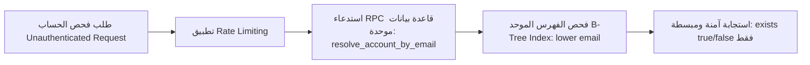

# خطة العمل الموثقة (PLAN-03): أمان وتوحيد منظومة الحسابات والمصادقة
## Unified Identity & Account Security Hardening Plan

**المعرف:** `PLAN-03`  
**الأولوية:** `P1 — أمان وأداء عالي للحسابات (High/Security)`  
**الفروع المعنية:** `perf/phase-6-foundation` (Web & DB)  
**المشاكل المرتبطة من وثيقة التدقيق:** `H-05`, `H-06`, `C-02`  
**تاريخ التوثيق:** 2026-10-04  
**الحالة:** معتمدة للتنفيذ (Approved for Execution)  

---

### 1. ملخص المشاكل الأمنية والمعمارية (Problem Statement)

1. **بطء وتشتت البحث بالبريد الإلكتروني (Sequential 9-Table Lookup - H-05):**
   - مسار فحص المستخدمين الحالي `/api/auth/check-user/route.ts` يقوم بالبحث بالبريد عبر المرور التتابعي على حوالي 9 جداول مختلفة (`users`, `players`, `clubs`, `academies`, `trainers`, `agents`, إلخ).
   - وفي حال عدم العثور، قد يستدعي:
     ```typescript
     supabase.auth.admin.listUsers({ perPage: 1000 })
     ```
     ثم يبحث داخل مصفوفة المستخدمين في ذاكرة Node.js.
   - **الخطر:** استهلاك عالي لزمن المعالجة (قد يتجاوز 1.5 - 3 ثوانٍ أثناء تسجيل الدخول) وتراجع الأداء مع نمو المستخدمين.

2. **ثغرة كشف الحسابات (Account Enumeration - H-06):**
   - المسار نفسه يرجع معلومات مفصلة للمتصل غير المصرح له إذا وُجد الحساب، مثل: `exists`, `userName`, `accountType`, `uid`، وفي بعض الحالات البريد الإلكتروني.
   - **الخطر الأمني:** يتيح للمهاجمين تجربة قوائم بريد وأرقام هواتف مسربة لاكتشاف المسجلين في المنصة ومعرفة أنواع حساباتهم وهوياتهم.

---

### 2. الحل الهندسي المقترح (Technical Blueprint)



#### أ. إنشاء دالة ومؤشر موحد في قاعدة البيانات (Canonical Database RPC)
* بدلاً من استعلام 9 جداول تتابعياً من خادم التطبيق، يتم الاعتماد على دالة SQL واحدة تعمل على مستوى المحرك الداخلي لقاعدة البيانات:
  ```sql
  CREATE OR REPLACE FUNCTION public.resolve_account_by_email(p_email text)
  RETURNS TABLE (
    account_id uuid,
    account_type text,
    is_active boolean
  ) 
  LANGUAGE plpgsql
  SECURITY DEFINER
  AS $$
  BEGIN
    RETURN QUERY
    SELECT u.id, u.account_type, u.is_active
    FROM public.users u
    WHERE lower(u.email) = lower(p_email)
    LIMIT 1;
  END;
  $$;
  ```
* **إنشاء الفهرس المركب:**
  ```sql
  CREATE INDEX IF NOT EXISTS idx_users_lower_email ON public.users (lower(email));
  ```

#### ب. تحصين مخرجات الـ API ومنع الـ Enumeration
* تعديل الاستجابة للطلبات غير الموثقة في مسار `/api/auth/check-user`:
  ```json
  // Request
  {
    "email": "user@example.com"
  }
  
  // Safe Public Response (200 OK)
  {
    "exists": true
  }
  ```
* **القاعدة:** لا يتم إرجاع الـ `uid` أو `accountType` أو الاسم الكامل إلا بعد إتمام المصادقة بنجاح والتحقق من كلمة المرور أو رمز الـ OTP.

#### ج. تفعيل محدد معدل الطلبات (Rate Limiting)
* حماية المسار من هجمات التخمين (Brute-force) عبر تحديد حد أقصى:
  * **5 طلبات فحص في الدقيقة لكل IP.**
  * في حال تجاوز الحد: إرجاع `429 Too Many Requests`.

---

### 3. خطوات التنفيذ والمؤشرات المرحلية (Execution Roadmap)

1. **الخطوة 1:** مراجعة كود [`src/app/api/auth/check-user/route.ts`](file:///d:/El7lm-V2/src/app/api/auth/check-user/route.ts) وإزالة استدعاء `listUsers({ perPage: 1000 })`.
2. **الخطوة 2:** تجهيز ملف الهجرة SQL للـ RPC والفهرس.
3. **الخطوة 3:** تقليص كائن الاستجابة للمتصلين غير الموثقين.
4. **الخطوة 4:** كتابة اختبارات فحص أمني (Security Negative Tests) للتحقق من منع تسريب البروفايل قبل المصادقة.
