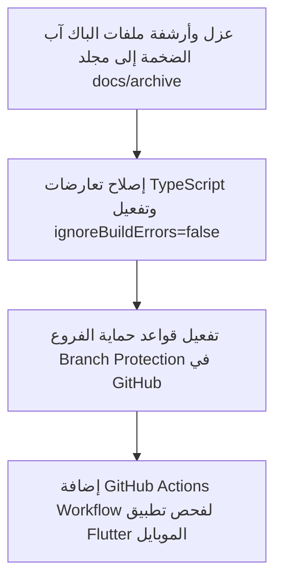

# خطة العمل الموثقة (PLAN-04): الحوكمة وأرشفة الملفات وإدارة الـ CI/CD
## Repository Governance, Archival & CI/CD Pipeline Plan

**المعرف:** `PLAN-04`  
**الأولوية:** `P2 — حوكمة وجودة واستدامة برمجية (Quality & Scale)`  
**الفروع المعنية:** جميع الفروع (`main`, `perf/phase-6-foundation`, `mobile-main`)  
**المشاكل المرتبطة من وثيقة التدقيق:** `H-07`, `H-08`, `W-M07`, `M-H07`  
**تاريخ التوثيق:** 2026-10-04  
**الحالة:** معتمدة للتنفيذ (Approved for Execution)  

---

### 1. ملخص المشاكل وتحديات بيئة العمل (Problem Statement)

1. **غياب حماية الفروع (Unprotected Branches - H-08):**
   - كافة فروع المستودع تظهر بحالة `protected: false`، مما يسمح بدفع كود تجريبي أو كسر الـ Build مباشرة على الفروع الرئيسية دون المرور بـ Pull Request أو فحوصات آلية.
2. **تجاهل أخطاء TypeScript والـ Lint أثناء البناء (Bypassed Type Checks - H-07):**
   - ملف `next.config.js` يحتوي على:
     ```javascript
     eslint: { ignoreDuringBuilds: true },
     typescript: { ignoreBuildErrors: true }
     ```
   - هذا يسمح لـ Vercel بنشر كود يحتوي على أخطاء أنواع وتعارضات قد تؤدي إلى انهيارات runtime غير متوقعة.
3. **تراكم ملفات النسخ الاحتياطي الضخمة (Bulky Backup Dumps in Repo):**
   - وجود ملفات JSON ضخمة متبقية من مراحل الترحيل السابقة داخل مسار الكود (مثل `backup_users_pre_phase10_20260925.json` بحجم **11.2 MB**، و `duplicate-phone-accounts.json` بحجم **1.1 MB**، و `phase6-1-duplicate-decision-audit.json` بحجم **2.6 MB**).
   - هذه الملفات تزيد من زمن `git clone`، وتعطل أدوات البحث السريع، وتثقل المستودع دون حاجة برمجية لها.
4. **غياب خط أنابيب CI لتطبيق الموبايل (No Flutter CI - M-H07):**
   - فرع الموبايل لا يمتلك فحصاً آلياً مماثلاً للويب للتأكد من سلامة البناء وتوافق الحزم عند كل تعديل.

---

### 2. خطة الحل التنفيذي خطوة بخطوة (Execution Blueprint)



#### أ. عزل وأرشفة الملفات الضخمة (File Archival Strategy)
* نقل كافة ملفات الـ JSON والـ LOG التي تم توليدها أثناء مراحل سابقة وانتهت الحاجة المباشرة إليها إلى مجلد موحد خارج مسار العمل اليومي:
  ```text
  docs/archive/phase-backups/
  ├── backup_users_pre_phase10_20260925.json (11.2 MB)
  ├── duplicate-phone-accounts.json (1.1 MB)
  ├── phase6-1-duplicate-decision-audit.json (2.6 MB)
  └── phone-identity-report.json (1.3 MB)
  ```
* إضافة قاعدة في `.gitignore` لمنع تتبع أي ملفات `.json` أو `.log` تزيد عن 500 KB في مجلدات التطوير مستقبلاً.

#### ب. تفعيل الفحص الصارم للـ TypeScript والـ Lint
* بمجرد تنظيف الأخطاء العالقة في الفرع:
  ```javascript
  // next.config.js
  eslint: {
    ignoreDuringBuilds: false,
  },
  typescript: {
    ignoreBuildErrors: false,
  },
  ```
* جعل نجاح أمر `npm run type-check` و `npm run lint` شرطاً إلزامياً لمرور أي Pull Request.

#### ج. تفعيل حماية الفروع في GitHub (Branch Protection Rules)
* تطبيق الحماية على الفرع الأساسي `main` والفرع التطويري النشط `perf/phase-6-foundation`:
  1. إلزام إنشاء Pull Request قبل الدمج (Require a pull request before merging).
  2. إلزام نجاح الفحوصات الآلية (Require status checks to pass before merging):
     - `Type check`
     - `ESLint`
     - `Security / Secret scan`
     - `Build`
  3. حظر الـ Force Push وحظر الحذف المباشر للفرع.

#### د. إضافة خط أنابيب CI لتطبيق الموبايل (Flutter CI Workflow)
* إنشاء ملف سير العمل: `.github/workflows/flutter-ci.yml`:
  ```yaml
  name: Flutter Mobile CI
  on:
    push:
      branches: [ mobile-main, 'mobile/**' ]
    pull_request:
      branches: [ mobile-main ]
  jobs:
    build:
      runs-on: ubuntu-latest
      steps:
        - uses: actions/checkout@v4
        - uses: subosito/flutter-action@v2
          with:
            flutter-version: '3.24.x'
            channel: 'stable'
        - run: flutter pub get
        - run: flutter analyze
        - run: flutter test
        - run: flutter build apk --debug
  ```

---

### 3. معيار اكتمال العمل الصارم (Definition of Done)
أي تعديل أو ميزة مستقبلية لا تُعتبر مكتملة إلا إذا استوفت المعايير التالية:
* ✅ يمر `npm run type-check` بنجاح بصفر أخطاء.
* ✅ يمر `npm run lint` بنجاح.
* ✅ صفر تسريب لـ Secrets في الكود أو ملفات الإعداد العامة.
* ✅ الـ APIs الجديدة تتضمن Pagination وتحديد صريح للحقول.
* ✅ توثيق أي تغيير في الـ Contracts في ملف المتابعة.
