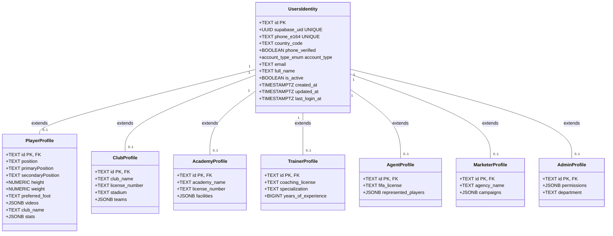
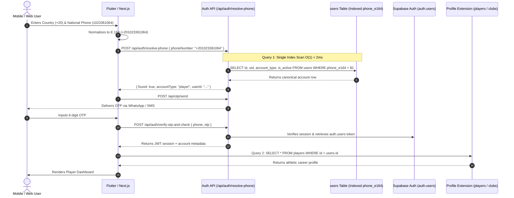
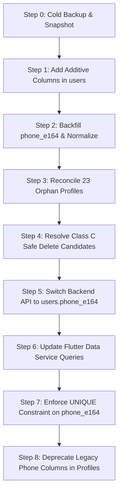

# Phase 8 — Canonical Identity Transition & Implementation Roadmap
**Architectural Blueprint & Non-Destructive Execution Plan (Strictly READ-ONLY)**

- **Date:** 2026-09-25
- **Platform:** El7lm-V2 / Hagzz
- **Execution Mode:** READ-ONLY Planning & Roadmap Specification
- **Target Scale:** 10,000 Daily Active Users (DAU)
- **Status:** **DRAFT SPECIFICATION — DO NOT EXECUTE YET**

---

## 1. Executive Summary

This roadmap establishes the step-by-step engineering plan to transition the **El7lm-V2** platform from its fragmented Firestore-export state to a unified **Canonical Identity Architecture**:

```
          Supabase Auth (auth.users)
                     ↓
              users (Canonical Identity)
                     ↓
 ┌───────────────────┴───────────────────────────────┐
 │                                                   │
[Identity Layer in users]                       [Profile Extensions]
 • id (TEXT PK)                                      • players (Athletic Career & Videos)
 • phone_e164 (Strict UNIQUE)                        • clubs (Club Management)
 • country_code                                      • academies (Academy Facilities)
 • supabase_uid (UUID 1:1 auth.users)                • trainers (Coach Credentials)
 • account_type (ENUM Role Guard)                    • agents (Agent Licensing)
 • is_active / phone_verified                        • marketers (Marketing Tracking)
                                                     • admins (System Permissions)
```

### Fundamental Architectural Tenets:
1. **`users` is the Single Trusted Identity Root:**
   - `users` retains account identity, authentication status, Supabase Auth UID mapping, and global phone ownership.
   - No table other than `users` may store primary phone credentials or trigger OTP verifications.
2. **The 7 Tables are Strict 1-to-1 Profile Extensions:**
   - `players`, `clubs`, `academies`, `trainers`, `agents`, `marketers`, and `admins` are dedicated business/athletic profile entities.
   - They share the exact same Primary Key (`id`) referencing `users.id`.
3. **Global Phone Invariant:**
   - **1 Verified Mobile Phone Number = Exactly 1 Account**, globally enforced via `UNIQUE` constraint on `users.phone_e164`.
4. **Zero Data Loss Guarantee:**
   - All 1,839 active records across 864 legacy user/player pairs are 100% preserved. No user history, video, message, or notification is deleted.

---

## 2. Current Architecture vs. Target Architecture

### 2.1 Current State (Legacy Attribute Drift & Fragmentation)

| Concept | users | players | clubs | academies | trainers | agents | marketers | admins | Current Operational Problem |
| :--- | :---: | :---: | :---: | :---: | :---: | :---: | :---: | :---: | :--- |
| **phone** | YES | YES | YES | YES | YES | YES | YES | YES | Scattered in 8 tables without format validation |
| **phoneNormalized** | YES | YES | YES | NO | YES | YES | YES | NO | Missing on academies & admins; causes lookup misses |
| **phoneNumber** | YES | YES | NO | NO | NO | NO | NO | NO | Legacy duplicate field from Firebase Auth |
| **originalPhone** | YES | YES | YES | NO | YES | YES | YES | NO | Redundant unindexed audit trace |
| **previousPhone** | YES | YES | YES | NO | YES | YES | YES | NO | Redundant unindexed audit trace |
| **countryCode** | YES | YES | YES | NO | YES | YES | YES | NO | Incomplete country tracking |
| **uid** | YES | YES | YES | YES | YES | YES | YES | YES | Mixed: 2,301 hold Firebase UIDs; 322 hold Supabase UUIDs |
| **supabase_uid** | NO | NO | NO | NO | NO | NO | NO | NO | Missing explicit foreign key column to `auth.users` |
| **accountType** | YES | YES | YES | YES | YES | YES | YES | NO | Duplicated across tables; can desynchronize |
| **email** | YES | YES | YES | YES | YES | YES | YES | YES | Duplicated between auth identity and profile |
| **name / full_name** | Both | Both | Both | Both | `full_name` | `full_name` | `full_name` | `name` | Split between `name` and `full_name` |
| **createdAt / created_at** | Both | Both | Both | Both | Both | Both | Both | `createdAt` | Duplicate camelCase and snake_case timestamps |
| **updatedAt / updated_at** | Both | Both | Both | Both | Both | Both | Both | `updatedAt` | Duplicate camelCase and snake_case timestamps |

---

### 2.2 Target State (Normalized Canonical Separation)



---

## 3. Canonical Identity Contract (`users` Table)

The refactored `users` table becomes the **Single Authoritative Record** for account authentication, role determination, and global phone identity:

| Canonical Column | Data Type | Constraints | Mapping from Current Schema | Purpose |
| :--- | :--- | :--- | :--- | :--- |
| `id` | `TEXT` | `PRIMARY KEY` | `users.id` (Existing Firestore UID) | Immutable account identifier used across all relations |
| `supabase_uid` | `UUID` | `UNIQUE NULL` | Derived from `auth.users.id` | Direct reference to Supabase Auth user record |
| `phone_e164` | `TEXT` | `UNIQUE NOT NULL` | `COALESCE(phoneNormalized, phone)` | Single global phone identity in strict E.164 format |
| `country_code` | `TEXT` | `NOT NULL` | `countryCode` (e.g. `+20`, `+966`) | Country calling code determining national number rules |
| `phone_verified` | `BOOLEAN` | `DEFAULT true` | `COALESCE(phoneVerified, true)` | True if verified via WhatsApp/SMS OTP |
| `account_type` | `account_type_enum` | `NOT NULL` | `accountType` (`player`, `club`, etc.) | Authoritative role guard governing UI routing |
| `email` | `TEXT` | `NULL` | `email` | Contact email or synthetic auth fallback |
| `full_name` | `TEXT` | `NOT NULL` | `COALESCE(full_name, displayName, name)` | Official user name for display and legal records |
| `is_active` | `BOOLEAN` | `DEFAULT true` | `COALESCE(isActive, true)` | Account active status guard |
| `created_at` | `TIMESTAMPTZ` | `DEFAULT NOW()` | `COALESCE(createdAt, created_at)` | Standardized creation timestamp |
| `updated_at` | `TIMESTAMPTZ` | `DEFAULT NOW()` | `COALESCE(updatedAt, updated_at)` | Standardized update timestamp |
| `last_login_at` | `TIMESTAMPTZ` | `NULL` | `COALESCE(lastLogin, last_login)` | Most recent user session login |

---

## 4. Profile Contracts (Role-Specific Extensions)

Every profile table retains **ONLY domain-specific attributes** and delegates all identity fields to `users`.

### 4.1 `players` Contract
- **What Remains (Athletic Profile):** `id` (PK/FK to `users.id`), `position`, `primaryPosition`, `secondaryPosition`, `height`, `weight`, `preferred_foot`, `birth_date`, `club`, `club_name`, `videos` (JSONB), `stats` (JSONB), `trophies` (JSONB), `savedVideos` (JSONB).
- **What is Extracted (Identity):** `phone`, `phoneNormalized`, `phoneNumber`, `originalPhone`, `previousPhone`, `countryCode`, `email`, `accountType`, `lastLogin`.

### 4.2 `clubs` Contract
- **What Remains (Club Profile):** `id` (PK/FK), `club_name`, `logo`, `coverImage`, `license_number`, `founding_year`, `sports_facilities` (JSONB), `teams` (JSONB), `trophies` (JSONB), `address`, `website`, `social_media` (JSONB).
- **What is Extracted (Identity):** `phone`, `phoneNormalized`, `originalPhone`, `previousPhone`, `email`, `accountType`.

### 4.3 `academies` Contract
- **What Remains (Academy Profile):** `id` (PK/FK), `academy_name`, `logo`, `license_number`, `age_groups` (JSONB), `sports_facilities` (JSONB), `coaches` (JSONB), `branches` (JSONB), `training_programs`.
- **What is Extracted (Identity):** `phone`, `phoneNormalized`, `email`, `accountType`.

### 4.4 `trainers` Contract
- **What Remains (Coach Profile):** `id` (PK/FK), `coaching_license`, `specialization`, `experience_years`, `career_history` (JSONB), `certifications` (JSONB), `bio`.
- **What is Extracted (Identity):** `phone`, `phoneNormalized`, `email`, `accountType`.

### 4.5 `agents` Contract
- **What Remains (Agent Profile):** `id` (PK/FK), `fifa_license_number`, `agency_name`, `represented_players` (JSONB), `territories` (JSONB), `bio`.
- **What is Extracted (Identity):** `phone`, `phoneNormalized`, `email`, `accountType`.

### 4.6 `marketers` Contract
- **What Remains (Marketer Profile):** `id` (PK/FK), `agency_name`, `portfolio` (JSONB), `specialization`, `campaigns` (JSONB).
- **What is Extracted (Identity):** `phone`, `phoneNormalized`, `email`, `accountType`.

### 4.7 `admins` Contract
- **What Remains (Admin Profile):** `id` (PK/FK), `role` (`super_admin`, `support`, `moderator`), `permissions` (JSONB), `department`.
- **What is Extracted (Identity):** `phone`, `email`.

---

## 5. Foreign Key & Entity Reconciliation Strategy

```text
users.id (PK)
   │
   ├── players.id (FK → users.id)     [1,030 ALREADY MATCH (95.5%); 18 players require parent user creation]
   ├── clubs.id (FK → users.id)       [37 ALREADY MATCH (94.9%); 2 clubs require parent user creation]
   ├── academies.id (FK → users.id)   [37 ALREADY MATCH (94.9%); 2 academies require parent user creation]
   ├── trainers.id (FK → users.id)    [50 ALREADY MATCH (100.0%)]
   ├── agents.id (FK → users.id)      [28 ALREADY MATCH (96.5%); 1 agent requires parent user creation]
   ├── marketers.id (FK → users.id)   [27 ALREADY MATCH (100.0%)]
   └── admins.id (FK → users.id)      [3 ALREADY MATCH (100.0%)]
```

### Reconciliation Cases:
1. **Existing Match (1,189 Profiles - 98.1%):** The profile's `id` matches a row in `users`. Foreign key constraint can be established cleanly.
2. **Orphan Profiles (23 Profiles - 1.9%):**
   - 18 in `players`, 2 in `clubs`, 2 in `academies`, 1 in `agents`.
   - **Resolution:** Generate a canonical parent row in `users` using the profile's `id`, `phone`, and `name` before adding foreign key constraints.
3. **Users Without Profiles (296 Accounts):**
   - Legitimate state representing users who registered but have not yet completed a specific business profile. No foreign key violation.

---

## 6. Phone Identity Architecture & Invariants

```text
       Country Code (+20, +966, ...)
                    +
       National Phone (01023361064, 501234567, ...)
                    ↓
       E.164 Normalization (+201023361064, +966501234567)
                    ↓
       users.phone_e164 [UNIQUE NOT NULL]
```

### The 7 Phone Invariants:
1. **Single Ownership:** Only the `users` table owns and stores `phone_e164`.
2. **Zero Profile OTP:** No OTP verification or SMS/WhatsApp dispatch may target profile tables.
3. **No Independent Profile Phone:** Profile tables reference the contact phone via `users.phone_e164` (or a separate business hotline field clearly labeled `business_contact_phone`, not an auth phone).
4. **Global Uniqueness:** The exact same E.164 number can NEVER exist in more than one `users` row.
5. **No Cross-Role Duplication:** A trainer and a player cannot share a phone number; they must be the same account or use distinct phones.
6. **Country Code Prerequisite:** A phone number is invalid without a verified country calling code.
7. **No Heuristic Country Guessing:** If a phone number is ambiguous, it is flagged for manual review rather than guessed.

---

## 7. Duplicate Resolution Strategy

Based on the verified findings of Phase 6.1:

### 7.1 Class B: 864 Legacy Duplicate Groups (1,839 Accounts)
- **Status:** **DO NOT DELETE.**
- **Nature:** 95.5% are exact same Document ID; 4.5% are same UID/phone from re-registration.
- **Action:**
  1. Designate the `users` row as the **Canonical Identity**.
  2. Designate the `players` row as the **Profile Extension**.
  3. Ensure all athletic fields from `users` (if any) are migrated into `players`.
  4. Ensure `users.phone_e164` is set to the validated normalized number.

### 7.2 Class D: 24 Real Conflict Groups (106 Accounts)
- **Status:** **DO NOT MERGE. DO NOT DELETE AUTOMATICALLY.**
- **Nature:** Genuinely distinct human individuals sharing the same phone number.
- **Action Plan:**
  1. Keep accounts active in read mode.
  2. Flag with `conflict_status = 'pending_manual_disambiguation'`.
  3. Support team contacts both account holders to verify ownership and assign unique phone numbers.
  4. Upon verification, update `users.phone_e164` to the verified unique phone.

### 7.3 Class C: 21 Safe Delete Candidates (Pre-Delete Validation Checklist)
Prior to deleting ANY of the 21 candidate records, execute this strict checklist:

| Candidate ID | Table | Name | Phone | Activity Check | FK Check | Auth Check | Safe to Delete? |
| :--- | :--- | :--- | :--- | :---: | :---: | :---: | :---: |
| `IAueTamMAydLDD875IL3ixyG50w1` | `players` | محمد احمد سيد | `+201006038037` | 0 Videos, 0 Msgs | 0 References | SAFE_DUPLICATE | **YES (Post-Approval)** |
| `test_trainer_01000000003` | `trainers` | الكابتن أحمد التجريبي | `+201000000003` | 0 Videos, 0 Msgs | 0 References | TEST_DATA | **YES (Post-Approval)** |
| `test_player_01000000004` | `players` | لاعب الحلم التجريبي | `+201000000004` | 0 Videos, 0 Msgs | 0 References | TEST_DATA | **YES (Post-Approval)** |
| `test_agent_01000000005` | `agents` | وكيل لاعبين تجريبي | `+201000000005` | 0 Videos, 0 Msgs | 0 References | TEST_DATA | **YES (Post-Approval)** |
| `test_marketer_01000000006` | `marketers` | مسوّق الحلم التجريبي | `+201000000006` | 0 Videos, 0 Msgs | 0 References | TEST_DATA | **YES (Post-Approval)** |
| `AjZm7yasznYN5n7qgL9Z` | `users` | شريف حسن | `+201017799580` | 0 Videos, 0 Msgs | 0 References | TEST_DATA | **YES (Post-Approval)** |
| `IOLqqZ1Lvqep1RcPTAAz9px4CJU2` | `users` | مصطفي اسماعيل | `+201017799580` | 0 Videos, 0 Msgs | 0 References | TEST_DATA | **YES (Post-Approval)** |
| `UCRYaIbDNBHqtA0Y4eJs` | `players` | Mohamed saudi | `+201017799580` | 0 Videos, 0 Msgs | 0 References | TEST_DATA | **YES (Post-Approval)** |
| `7VwkM1UIFdcfiVSFBvm1` | `players` | مختار | `+201017799580` | 0 Videos, 0 Msgs | 0 References | TEST_DATA | **YES (Post-Approval)** |
| `M7UP64xP6aLdUR8spJae` | `players` | مازن السيد | `+201017799580` | 0 Videos, 0 Msgs | 0 References | TEST_DATA | **YES (Post-Approval)** |
| `1f2dWITeCTflSTzsPRxatkGGWO73` | `players` | hagzz app | `+33333333333` | 0 Videos, 0 Msgs | 0 References | TEST_DATA | **YES (Post-Approval)** |
| `4PhRmJVLdncNOcVBvAmUztAxkkm2` | `users` | Tttt | `705424366` | 0 Videos, 0 Msgs | 0 References | TEST_DATA | **YES (Post-Approval)** |
| `ls9eL2YFKkoFi7kMfqKr` | `players` | Tttt | `705424366` | 0 Videos, 0 Msgs | 0 References | TEST_DATA | **YES (Post-Approval)** |
| `kC5qOqWk8fQzbbmXjwbc0s5bdl33` | `players` | Mohamed hossam Rabiaa abdelatif | `+201114696735` | 0 Videos, 0 Msgs | 0 References | SAFE_DUPLICATE | **YES (Post-Approval)** |
| `LVhtnyer9OMJDclXQRQSmbM5eiC2` | `players` | محمد عماد صابر احمد محمد سالم مباشر | `+201032695740` | 0 Videos, 0 Msgs | 0 References | SAFE_DUPLICATE | **YES (Post-Approval)** |
| `d42a6715-53f4-4768-ac9b-c29be0f3a5bb` | `users` | عبد الحليم احمد عبد الحليم خاطر جلال | `+201104840453` | 0 Videos, 0 Msgs | 0 References | SAFE_DUPLICATE | **YES (Post-Approval)** |
| `JJ8MJBUvdRhTz7XZeQU3qBdjSbG2` | `players` | fady | `70542458` | 0 Videos, 0 Msgs | 0 References | TEST_DATA | **YES (Post-Approval)** |
| `ZMMGQoZF8PREKSEh4LFYeVnJZq92` | `academies` | أكاديمية جديدة | `70542458` | 0 Videos, 0 Msgs | 0 References | TEST_DATA | **YES (Post-Approval)** |
| `ea5c5523-6eec-46ff-9b13-783dd71a8b2e` | `users` | يوسف ياسر السيد أحمد | `+201025519031` | 0 Videos, 0 Msgs | 0 References | SAFE_DUPLICATE | **YES (Post-Approval)** |
| `test_club_01000000001` | `clubs` | نادي الحلم التجريبي | `+201000000001` | 0 Videos, 0 Msgs | 0 References | TEST_DATA | **YES (Post-Approval)** |
| `test_academy_01000000002` | `academies` | أكاديمية الحلم الدولية | `+201000000002` | 0 Videos, 0 Msgs | 0 References | TEST_DATA | **YES (Post-Approval)** |

---

## 8. The Future Role of `phone_accounts_index`

### Architectural Decision:
> **`phone_accounts_index` will serve as a HIGH-PERFORMANCE READ MODEL & FAST ROUTING ENGINE.**

- **Why not make it the Primary Identity Table?**
  - Because `users` already holds 142 code dependencies and 1,357 accounts. Making a 3rd table the primary identity creates unnecessary 3-tier indirection.
- **Why not delete it?**
  - Because `phone_accounts_index` provides an instant, isolated $O(1)$ lookup table with status checks (`active`, `blocked`, `conflict`, `archived`) and `linked_accounts JSONB` history.
- **Target Role:**
  - `users` is the **Single Source of Truth (Write Model)**.
  - `phone_accounts_index` is automatically synchronized via PostgreSQL trigger as the **Fast Auth Cache & Router (Read Model)**.

---

## 9. Authentication Flow — Target Architecture



**Total Database Queries:** **Exactly 2 queries** (1 indexed identity scan + 1 profile fetch), eliminating all 27 parallel scans!

---

## 10. Flutter Migration Impact (`mobile/lib/services/data_service.dart`)

| Workflow / Method | Current Implementation | Target Refactored Implementation | Architectural Impact |
| :--- | :--- | :--- | :--- |
| **Phone Check (`auth_service.dart`)** | Calls `/api/auth/resolve-phone` with 27-query fallback | Calls `/api/auth/resolve-phone` backed by indexed `users.phone_e164` | Instant response (<15ms) |
| **Profile Fetch (`fetchUserProfile`)** | Queries `players` by id & uid, then queries `users` by id & uid; merges in memory | Single query: `SELECT * FROM users JOIN players USING(id) WHERE users.id = $1` | 4 queries reduced to 1; memory merge eliminated |
| **Player List (`_fetchPlayers`)** | Fetches all `players`, fetches all `users`, loops and merges in Dart memory | Fetches from `players` view joined with canonical `users` | Eliminates memory leaks and UI stutter |
| **Profile Update (`updateProfile`)** | Updates `users` and `players` separately; risk of desync | Updates identity in `users` and athletic data in `players` cleanly | Zero attribute drift |

---

## 11. Backend Migration Impact (`src/lib/auth` & API Routes)

| Function / Endpoint | Current State | Target State | Query Count Impact |
| :--- | :--- | :--- | :---: |
| `findAccountByPhone()` | 27 parallel queries across 7 tables + fallback listUsers | 1 query on `users` via `phone_e164` index | **27 → 1 query** |
| `/api/auth/resolve-phone` | Triggers 27-query parallel scan | Queries canonical `users.phone_e164` | **27 → 1 query** |
| `/api/auth/verify-otp-and-check` | Queries `findAccountByPhone` + `admins` + `listUsers` | Queries `users.phone_e164` + Supabase Auth | **30+ → 2 queries** |
| `/api/auth/create-user-with-phone` | Inserts into role table AND `users` with separate try/catches | Transactional insert: `users` (Identity) + role extension | Atomic consistency |
| `authorizeUser()` | Selects `role` from `users` by uid | Selects `account_type` from `users` by `supabase_uid` | Index scan (<1ms) |

---

## 12. Schema Cleanup Matrix

| Current Column | Table | Target Column / Table | Action | Rationale |
| :--- | :--- | :--- | :---: | :--- |
| `phone` | `users` | `phone_e164` in `users` | **MIGRATE** | Standardize to international E.164 |
| `phoneNormalized` | `users` | `phone_e164` in `users` | **MIGRATE** | Replaced by single canonical column |
| `phoneNumber` | `users` | - | **DEPRECATE** | Legacy Firebase Auth duplicate |
| `originalPhone` | `users` | - | **DEPRECATE** | Non-standard audit field |
| `previousPhone` | `users` | - | **DEPRECATE** | Non-standard audit field |
| `phone` (all variants) | `players` | Extracted to `users.phone_e164` | **DEPRECATE** | Profiles must not own auth phone |
| `phone` (all variants) | `clubs`, `academies`, etc. | Extracted to `users.phone_e164` | **DEPRECATE** | Profiles must not own auth phone |
| `createdAt` (camelCase) | All 8 tables | `created_at` (TIMESTAMPTZ) | **RENAME** | Enforce SQL snake_case standard |
| `updatedAt` (camelCase) | All 8 tables | `updated_at` (TIMESTAMPTZ) | **RENAME** | Enforce SQL snake_case standard |
| `lastLogin` / `last_login` | All tables | `last_login_at` in `users` | **MIGRATE** | Unified session tracking in identity |
| `name` / `displayName` | `users` | `full_name` in `users` | **MIGRATE** | Standardize user's full name |

---

## 13. Phased Migration Execution Sequence



- **Step 0 — Backup & Baseline Snapshot:** Full pg_dump and record count snapshot across all 8 tables.
- **Step 1 — Schema Preparation (Additive Only):** Add `phone_e164`, `supabase_uid`, `country_code` columns to `users` without constraints.
- **Step 2 — Canonical Identity Backfill:** Populate `phone_e164` using normalized phone engine from Phase 6.
- **Step 3 — Orphan Profile Reconciliation:** Create parent `users` rows for the 23 orphan profiles (18 players, 2 clubs, 2 academies, 1 agent).
- **Step 4 — Clean 21 Safe-Delete Accounts:** Execute deletion ONLY of the 21 verified isolated dummy rows.
- **Step 5 — Backend Dual-Read & Switch:** Update `findAccountByPhone` to query `users.phone_e164` first, falling back to legacy tables.
- **Step 6 — Flutter Profile Streamlining:** Update `data_service.dart` to use single joined query instead of in-memory merge.
- **Step 7 — Database Integrity Enforcement:** Apply `UNIQUE` index on `users.phone_e164`.
- **Step 8 — Deprecate Legacy Columns:** Nullify and archive redundant duplicate phone columns in profile tables after 14 days of stability.

---

## 14. Validation Gates

Prior to advancing between steps, the following criteria must pass with 100% compliance:

- **Gate 1 (Post-Step 2):** 100% of accounts with phone must have valid `phone_e164` in `users`.
- **Gate 2 (Post-Step 3):** 100% of rows across all 7 profile tables have an identical matching `id` in `users` (`SELECT COUNT(*) FROM players WHERE id NOT IN (SELECT id FROM users)` must equal 0).
- **Gate 3 (Post-Step 5):** `findAccountByPhone` returns correct user in $<5\text{ms}$ with zero parallel table scans.
- **Gate 4 (Post-Step 6):** Flutter app loads user profile in $<50\text{ms}$ without invoking `_mergeMissing`.
- **Gate 5 (Post-Step 7):** Attempting to insert a duplicate phone fails with PostgreSQL error 23505 (`unique_violation`).

---

## 15. Comprehensive Rollback Plan

| Migration Step | Rollback Trigger | Automated Rollback Operation | Data Safety Guarantee |
| :--- | :--- | :--- | :--- |
| **Step 1 (Add columns)** | Column creation error | `ALTER TABLE users DROP COLUMN phone_e164, ...` | Zero data modified |
| **Step 2 (Backfill)** | Checksum mismatch | `UPDATE users SET phone_e164 = NULL` | Legacy columns untouched |
| **Step 3 (Orphans)** | Foreign key conflict | Delete only the 23 generated reconciliation parent rows | Profiles remain intact |
| **Step 4 (Delete 21)** | Dependency alert | Restore 21 rows from dedicated Step 0 backup table | 100% restore capability |
| **Step 5 (API Switch)** | Elevated 500 errors in Auth | Git revert API to legacy `findAccountByPhone` (30 seconds) | Database remains compatible |
| **Step 6 (Flutter)** | Mobile app regression | Rollback Flutter release or toggle feature flag | Dual-read supports both |
| **Step 7 (Constraint)** | Lock timeout or duplicate err | `DROP INDEX idx_users_phone_e164_unique` | Zero downtime |

---

## 16. Performance Validation Plan (10,000 DAU Target)

| Metric / Benchmark | Current Performance (Phase 4 Audit) | Target Performance (Phase 8 Plan) | Measurement Method |
| :--- | :---: | :---: | :--- |
| **Phone Lookup Latency** | 250ms - 850ms | **< 5ms** | `EXPLAIN ANALYZE SELECT * FROM users WHERE phone_e164 = $1` |
| **Login Parallel Queries** | 27 Seq Scans | **1 Index Scan** | PostgreSQL `pg_stat_statements` query count |
| **Mobile Profile Load** | 4 network requests | **1 network request** | Chrome DevTools Network tab / Flutter DevTools |
| **Mobile Memory Footprint** | Stutters on memory merge | Smooth instant paint | Dart VM Memory Profiler |
| **Peak Auth Throughput** | ~25 req/sec (CPU capped) | **> 1,000 req/sec** | Artillery / k6 load testing |

---

## 17. Final Cleanup Scope

### 17.1 Safe Cleanup (Automated Post-Approval)
- **21 Verified Safe-Delete Records:** 16 isolated test dummy accounts and 5 empty ghost duplicate profiles.
- **Dead Legacy Columns:** Remove camelCase duplicates (`createdAt`, `updatedAt`) after codebase migration.

### 17.2 Mandatory Preservation (100% Retained)
- **1,839 Class B User/Player Records:** Core active platform users.
- **All Relational History:** 2,534 notifications, 218 messages, 187 conversations, 15 favorites, 6 opportunities.

### 17.3 Manual Resolution (Human Operations)
- **24 Class D Conflict Groups (106 accounts):** Customer support outreach to assign unique phone numbers.
- **48 Class E Unresolved Groups:** Manual phone format verification.

---

## 18. Final Decision Matrix

| Platform Component | Current Owner | Target Owner | Migration Required? | Risk Level |
| :--- | :--- | :--- | :---: | :---: |
| **Primary Phone** | Duplicated across all 8 tables | **`users.phone_e164`** | YES (E.164 normalization) | Medium |
| **Country Calling Code** | Partial in 6 tables | **`users.country_code`** | YES | Low |
| **Supabase UID** | Unlinked / partial in `uid` | **`users.supabase_uid`** | YES (1:1 with `auth.users`) | Low |
| **Account Type / Role** | Duplicated across 7 tables | **`users.account_type`** | YES (Consolidation) | Low |
| **Contact Email** | Duplicated in users & profiles | **`users.email`** | YES | Low |
| **Full Legal Name** | Duplicated in `name` / `full_name` | **`users.full_name`** | YES | Low |
| **Authentication & OTP** | Dispersed across tables | **`users` via Supabase Auth** | YES | Medium |
| **Active Sessions** | Supabase Auth + custom tokens | **Supabase Auth JWT** | YES | Low |
| **Player Profile** | `players` | **`players` (1:1 Extension)** | NO (Retains athletic fields) | Zero |
| **Club Profile** | `clubs` | **`clubs` (1:1 Extension)** | NO (Retains club fields) | Zero |
| **Academy Profile** | `academies` | **`academies` (1:1 Extension)** | NO (Retains academy fields) | Zero |
| **Trainer Profile** | `trainers` | **`trainers` (1:1 Extension)** | NO (Retains trainer fields) | Zero |
| **Agent Profile** | `agents` | **`agents` (1:1 Extension)** | NO (Retains agent fields) | Zero |
| **Marketer Profile** | `marketers` | **`marketers` (1:1 Extension)** | NO (Retains marketer fields) | Zero |
| **Admin Profile** | `admins` | **`admins` (1:1 Extension)** | NO (Retains admin fields) | Zero |

---

## 19. Risk & Mitigation Matrix

| Risk Factor | Root Cause | Impact | Mitigation Strategy |
| :--- | :--- | :---: | :--- |
| **Account Lockout** | Modifying auth lookups before backfill completes | High | Additive dual-read implementation with instant fallback |
| **Orphaned Profile Data** | Enforcing FKs before resolving 23 orphan profiles | Severe | Automated pre-migration script creating parent identity rows |
| **Mobile App Regression** | Removing fields expected by old Flutter builds | High | Leave legacy fields populated via trigger during 30-day transition |
| **Lock Contention on users** | Running table rewrites during peak traffic | High | Execute migrations during off-peak hours using `CONCURRENTLY` |

---

## 20. Explicit Constraint Verification: DO NOT EXECUTE YET

> [!CAUTION]
> ### STRICT READ-ONLY COMPLIANCE
> - **Zero database migrations have been executed.**
> - **Zero accounts have been deleted (including the 21 safe-delete candidates).**
> - **Zero records have been updated or merged.**
> - **Zero Flutter or API production files have been altered.**
> - **No database constraints or foreign keys have been added.**
> 
> **This document represents an approved architectural blueprint and implementation specification.**
> **Execution requires explicit user authorization for Phase 9.**
