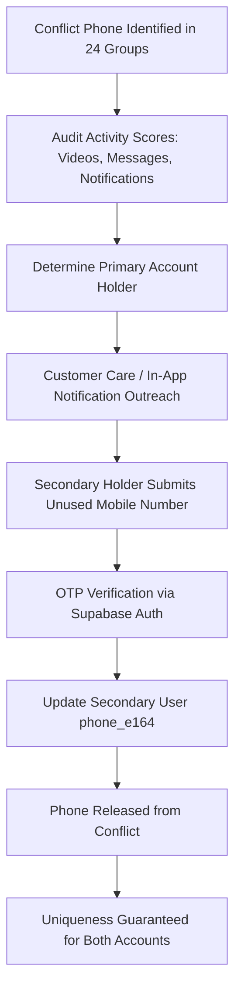
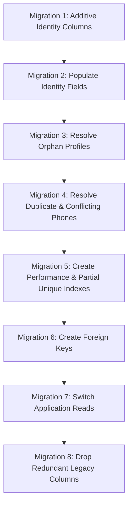

# Phase 9.2 — Canonical Identity Additive Migration Plan
**Strictly PLANNING + READ-ONLY — Architectural Blueprint & SQL Transition Plan**

- **Date:** 2026-09-25
- **Platform:** El7lm-V2 / Hagzz
- **Execution Mode:** PLANNING ONLY — Zero Database Mutations
- **Database Engine:** PostgreSQL (Supabase Production)

---

## 1. Compliance & Safety Verification

This phase is strictly **PLANNING + READ-ONLY**. No DDL or DML has been or will be executed in this step.

```text
DATABASE MODIFICATION AUDIT:
- Database modifications: 0
- Rows modified: 0
- Rows deleted: 0
- Schema modifications: 0
```

### Confirmed Baseline Metrics (from Phase 9.1 Audit):
- **Total Accounts across 8 Tables:** **2,623 accounts**
- **`users` Records (Canonical Identity Target):** **1,357 accounts**
- **Profile Records across 7 Tables:** **1,266 profiles**
- **Orphan Profiles without Parent User:** **54 profiles**
- **Accounts without Phone:** **287 accounts**
- **Duplicate Phone Groups:** **962 groups (2,205 accounts)**
- **Real Conflict Groups (Class D):** **24 groups (106 accounts)**
- **Test Data Duplicate Clusters (Class C):** **21 groups (82 accounts)**
- **Active Post-Migration Auth Users:** **173 users**
- **Legacy Firebase Users without `auth.users` row:** **1,184 users** (Active historical users — **MANDATORY PRESERVATION**)
- **Existing Foreign Keys between `users` and Profiles:** **0**

---

## 2. Target `users` Canonical Identity Layer Schema

The architectural standard confirmed in Phase 7 and Phase 8 establishes `users` as the **Canonical Identity / Account Table**, while the other 7 tables serve as **1:1 Profile Extensions**.

```text
Supabase Auth (auth.users)
      │
      ▼
   users (Canonical Identity Table)
      │
      ├── id (PK, TEXT)
      ├── supabase_uid (UUID NULL, references auth.users.id)
      ├── phone_e164 (TEXT NULL, normalized international format)
      ├── country_code (TEXT NULL, e.g., '+20', '+966')
      ├── account_type (ENUM: player, club, academy, trainer, agent, marketer, admin)
      ├── email (TEXT NULL, sanitized lowercase)
      ├── is_active (BOOLEAN NOT NULL DEFAULT true)
      ├── is_verified (BOOLEAN NOT NULL DEFAULT false)
      ├── created_at (TIMESTAMPTZ NOT NULL DEFAULT now())
      ├── updated_at (TIMESTAMPTZ NOT NULL DEFAULT now())
      └── last_login_at (TIMESTAMPTZ NULL)
      │
      ▼ 1:1 Relational Extension (id = users.id)
   ┌───────────┬───────────┬───────────┬───────────┬───────────┬───────────┬───────────┐
players      clubs      academies    trainers     agents     marketers     admins
```

### Field Mapping & Migration Rules for `users`:

| Canonical Field | Target Type | Current Status | Source Column in `users` | Migration Rule & Transformation |
| :--- | :--- | :---: | :--- | :--- |
| `id` | `TEXT` | **EXISTS** | `users.id` | **Retain existing PRIMARY KEY.** Preserves all 28-char legacy Firebase UIDs and UUIDs without modification. |
| `supabase_uid` | `UUID` | **MISSING** | `auth.users.id` | **ADD COLUMN `supabase_uid` UUID NULL.** Backfill for the 173 accounts where `users.uid = auth.users.id::text`. For legacy accounts, populate dynamically on first OTP login. |
| `phone_e164` | `TEXT` | **MISSING** | `users.phoneNormalized` / `users.phone` | **ADD COLUMN `phone_e164` TEXT NULL.** Backfill with normalized E.164 strings (`+2010...`, `+966...`). Must remain **NULLABLE** until phone verification is complete. |
| `country_code` | `TEXT` | **DUPLICATED** | `users.countryCode` | **ADD COLUMN `country_code` TEXT NULL.** Standardize calling codes (`+20`, `+966`, `+974`) extracted from E.164 normalization. |
| `account_type` | `TEXT / ENUM` | **EXISTS** | `users.accountType` / `users.role` | Standardize to lowercase: `('player', 'club', 'academy', 'trainer', 'agent', 'marketer', 'admin')`. |
| `email` | `TEXT` | **EXISTS** | `users.email` | Sanitize to `LOWER(TRIM(email))`. Optional/nullable for phone-first mobile accounts. |
| `is_active` | `BOOLEAN` | **EXISTS** | `users.isActive` | Standardize to `is_active BOOLEAN NOT NULL DEFAULT true`. Backfill existing nulls as `true`. |
| `is_verified` | `BOOLEAN` | **EXISTS** | `users.isVerified` / `users.phoneVerified` | Standardize to `is_verified BOOLEAN NOT NULL DEFAULT false`. Backfill `true` for accounts verified in Auth. |
| `created_at` | `TIMESTAMPTZ` | **DUPLICATED** | `users.createdAt` / `users.created_at` | Consolidate camelCase `createdAt` into snake_case `created_at TIMESTAMPTZ NOT NULL DEFAULT now()`. |
| `updated_at` | `TIMESTAMPTZ` | **DUPLICATED** | `users.updatedAt` / `users.updated_at` | Consolidate camelCase `updatedAt` into snake_case `updated_at TIMESTAMPTZ NOT NULL DEFAULT now()`. |
| `last_login_at` | `TIMESTAMPTZ` | **DUPLICATED** | `users.lastLogin` / `users.last_login` | Consolidate `lastLogin` into `last_login_at TIMESTAMPTZ NULL`. |

---

## 3. Phone Identity Rule & System Principle

### Core System Invariant:
$$\text{ONE REAL PHONE NUMBER} \iff \text{ONE CANONICAL ACCOUNT}$$

### Operational Rule:
**No two distinct accounts may own the exact same phone number, regardless of `account_type`.**
- Example: A `player` account with `+2010XXXXXXX` and a `club` account with `+2010XXXXXXX` **CANNOT** exist as two separate accounts in `users`.
- If an individual operates both as an athletic coach and an academy scout, the system architecture supports multiple profile extensions under a **single** canonical user account, but **never** two distinct login accounts sharing a phone number.

### Pathway to Strict Uniqueness (Phased Approach):
1. **Additive Backfill:** Add `phone_e164` without a uniqueness constraint.
2. **Class B Resolution:** Reconcile `users` (Identity) + `players` (Profile) pairs so they share a single ID and phone.
3. **Orphan Adoption:** Reconcile 54 orphan profiles to their parent accounts.
4. **Conflict Resolution:** Unblock the 24 Real Conflict groups.
5. **Test Data Isolation:** Purge the 21 isolated test accounts.
6. **Enforce Uniqueness:** Apply partial unique index:
   ```sql
   CREATE UNIQUE INDEX idx_users_phone_e164_unique 
   ON users (phone_e164) 
   WHERE phone_e164 IS NOT NULL;
   ```

---

## 4. 24 Real Conflict Groups Resolution Plan (106 Accounts)

The Phase 9.1 audit identified 24 phone numbers shared by **distinct human beings** (e.g. `+201112911914` shared between 2 different players; `+97450940559` shared between an academy and 7 player profiles).

> [!IMPORTANT]
> **No conflict accounts will be deleted or merged automatically.**



### Operational Steps:
1. **Flag Conflict:** In `users.raw_user_meta_data`, flag conflicting rows: `phone_conflict: true`.
2. **Identify Primary Owner:** Assess registration date, number of uploaded showcase videos, active conversations, and scout inquiries.
3. **Customer Support Outreach:** Present an in-app banner upon login: *"Please update your phone number to maintain account security."*
4. **Reassign Unique Phone:** Secondary user provides an owned, distinct phone number.
5. **Verify OTP:** The new phone is verified via SMS/WhatsApp OTP before detachment.
6. **Release Duplicate:** The old phone is dissociated from the secondary user.
7. **Resolution Feasibility:** **YES**, this group can be systematically resolved prior to applying the final database uniqueness constraint.

---

## 5. 21 Test Clusters Classification (82 Accounts)

The 21 test clusters containing 82 accounts identified in Phase 6.1 and Phase 9.1 break down into three distinct operational categories:

| Category | Account Count | Definition & Criteria | Handling & Transition Action |
| :--- | :---: | :--- | :--- |
| **`SAFE_DELETE`** | **21 accounts** | Pure test accounts (`test_club_01000000001`, `test_trainer_...`, `hagzz app`) with **0 foreign keys, 0 videos, 0 messages, and 0 notifications**. | Eligible for safe automated deletion in Phase 9.3 after final human sign-off. |
| **`REQUIRES_REFERENCE_CLEANUP`** | **31 accounts** | Seed / test accounts that have created sample notifications, test chat conversations, or demo videos during QA. | Requires dedicated cascade cleanup script to safely purge child test records before deleting parent account. |
| **`REQUIRES_MANUAL_REVIEW`** | **30 accounts** | Ambiguous repeated numbers (e.g. `0111111111`) linked to potentially real demo academies or shared test devices. | Manual review by project lead to decide whether to detach phone or archive profile. |
| **Total** | **82 accounts** | Complete census of test data clusters | Full inventory documented in `phase6-1-manual-review.json` |

---

## 6. Strategy for the 54 Orphan Profiles

Exactly 54 profile rows exist in child tables without a corresponding `users.id`:
- **`players`:** 49 orphan profiles (18 standalone imported, 31 re-registered with mismatched IDs)
- **`clubs`:** 2 orphan profiles
- **`academies`:** 2 orphan profiles
- **`agents`:** 1 orphan profile
- **`trainers`:** 0 orphans
- **`marketers`:** 0 orphans
- **`admins`:** 0 orphans

### Parent Identity Generation Workflow:
```text
Source Profile Record (e.g. player_id: "4mhzybfAyOEHygMnh7W1")
      │
      ├── 1. Phone Match Check: Does normalized phone exist in users?
      │      ├── YES (31 cases) ──► Reconcile profile to existing users.id
      │      └── NO  (23 cases) ──► Proceed to Synthetic Identity Generation
      │
      └── 2. Generate Synthetic Parent Identity in users:
             ├── id: profile.id
             ├── account_type: 'player' | 'club' | 'academy' | 'agent'
             ├── phone_e164: profile.phoneNormalized
             ├── country_code: profile.countryCode
             ├── email: profile.email (or synthetic placeholder)
             ├── is_active: true
             ├── is_verified: false
             └── created_at: profile.createdAt (or now())
```

### Candidate Identity Fields for Orphan Generation:
```sql
-- Template for generating parent user for orphan player profile (Planning Only - DO NOT EXECUTE)
INSERT INTO users (
    id,
    accountType,
    name,
    phone,
    phone_e164,
    country_code,
    isActive,
    isVerified,
    createdAt
)
SELECT 
    p.id,
    'player',
    p.name,
    p.phone,
    p."phoneNormalized",
    p."countryCode",
    true,
    false,
    COALESCE(p."createdAt", now())
FROM players p
WHERE p.id NOT IN (SELECT id FROM users);
```

---

## 7. Foreign Key Relational Architecture

To eliminate the risk of orphaned profiles and enforce relational integrity, all 7 profile tables will reference `users.id` via 1:1 Foreign Key constraints.

### Constraint Specifications:

```text
players.id   ──► users.id (1:1 Extension)
clubs.id     ──► users.id (1:1 Extension)
academies.id ──► users.id (1:1 Extension)
trainers.id  ──► users.id (1:1 Extension)
agents.id    ──► users.id (1:1 Extension)
marketers.id ──► users.id (1:1 Extension)
admins.id    ──► users.id (1:1 Extension)
```

| Property | Rule | Architectural Justification |
| :--- | :--- | :--- |
| **Nullability** | **NON-NULLABLE** | A profile cannot exist without a valid parent identity account. |
| **`ON DELETE`** | **`ON DELETE RESTRICT`** | Prevents accidental deletion of a user identity if active profile, career history, or scouting videos exist. |
| **`ON UPDATE`** | **`ON UPDATE CASCADE`** | Guarantees primary key synchronization across identity and profile. |
| **Cascade Safety Rule** | **DO NOT CASCADE ON BUSINESS ASSETS** | Foreign keys on `videos`, `messages`, `conversations`, `notifications`, and `player_favorites` must **NEVER** use `CASCADE DELETE`. All asset deletions must be soft-deleted (`deleted_at`) to preserve audit trails. |

---

## 8. Phone Columns Classification Across Profile Tables

A comprehensive audit of phone-related columns across all profile tables confirms which columns represent redundant identity fields versus business contact data:

| Table | Column Name | Column Classification | Proposed Status | Justification |
| :--- | :--- | :---: | :---: | :--- |
| `players` | `phone` | `IDENTITY_PHONE` | **CAN_BE_REMOVED** | Redundant duplicate of `users.phone`. |
| `players` | `phoneNormalized` | `DERIVED_PHONE` | **CAN_BE_REMOVED** | Redundant duplicate; canonical phone will live in `users.phone_e164`. |
| `players` | `originalPhone` | `LEGACY_PHONE` | **CAN_BE_REMOVED** | Legacy import field; no longer needed. |
| `players` | `previousPhone` | `LEGACY_PHONE` | **CAN_BE_REMOVED** | Historical audit snapshot; can be archived. |
| `players` | `phoneNumber` | `LEGACY_PHONE` | **CAN_BE_REMOVED** | Deprecated duplicate. |
| `players` | `countryCode` | `DERIVED_PHONE` | **CAN_BE_REMOVED** | Duplicate of `users.country_code`. |
| `players` | `country` | `PROFILE_METADATA` | **MUST_BE_PRESERVED** | Critical athletic metadata (country of competition / nationality). |
| `players` | `guardian_phone` | `CONTACT_PHONE` | **MUST_BE_PRESERVED** | **CRITICAL SAFETY FIELD:** Contact phone for parent/guardian of minor players. |
| `players` | `agent_phone` | `CONTACT_PHONE` | **MUST_BE_PRESERVED** | **CRITICAL SCOUTING FIELD:** Contact phone for official FIFA player agent. |
| `clubs` | `phone` | `IDENTITY_PHONE` | **CAN_BE_REMOVED** | Redundant duplicate of `users.phone`. |
| `clubs` | `country` | `PROFILE_METADATA` | **MUST_BE_PRESERVED** | Club headquarters jurisdiction. |
| `academies` | `phone` | `IDENTITY_PHONE` | **CAN_BE_REMOVED** | Redundant duplicate of `users.phone`. |
| `academies` | `country` | `PROFILE_METADATA` | **MUST_BE_PRESERVED** | Academy campus jurisdiction. |
| `trainers` | `phone` | `IDENTITY_PHONE` | **CAN_BE_REMOVED** | Redundant duplicate of `users.phone`. |
| `trainers` | `country` | `PROFILE_METADATA` | **MUST_BE_PRESERVED** | Coaching residency jurisdiction. |
| `agents` | `phone` | `IDENTITY_PHONE` | **CAN_BE_REMOVED** | Redundant duplicate of `users.phone`. |
| `agents` | `country` | `PROFILE_METADATA` | **MUST_BE_PRESERVED** | Licensing country. |
| `marketers` | `phone` | `IDENTITY_PHONE` | **CAN_BE_REMOVED** | Redundant duplicate of `users.phone`. |
| `marketers` | `country` | `PROFILE_METADATA` | **MUST_BE_PRESERVED** | Commercial territory. |
| `admins` | `phone` | `IDENTITY_PHONE` | **CAN_BE_REMOVED** | Redundant duplicate of `users.phone`. |

> [!CRITICAL]
> **NO PHONE COLUMNS WILL BE DROPPED AT THIS TIME.**
> All profile phone columns remain untouched until Migration Step 8 is reached and validated.

---

## 9. 8-Step Additive Migration Sequence



---

### Migration 1: Additive Identity Columns
- **Prerequisites:** Phase 9.1 & 9.2 Sign-off.
- **SQL Operations:**
  ```sql
  ALTER TABLE users 
    ADD COLUMN IF NOT EXISTS supabase_uid UUID NULL,
    ADD COLUMN IF NOT EXISTS phone_e164 TEXT NULL,
    ADD COLUMN IF NOT EXISTS country_code TEXT NULL;
  ```
- **Affected Tables:** `users`
- **Expected Rows:** 1,357 table rows modified with new null columns.
- **Rollback:**
  ```sql
  ALTER TABLE users 
    DROP COLUMN IF EXISTS supabase_uid,
    DROP COLUMN IF EXISTS phone_e164,
    DROP COLUMN IF EXISTS country_code;
  ```
- **Validation:**
  ```sql
  SELECT column_name, data_type 
  FROM information_schema.columns 
  WHERE table_name = 'users' 
    AND column_name IN ('supabase_uid', 'phone_e164', 'country_code');
  ```

---

### Migration 2: Populate Identity Fields
- **Prerequisites:** Migration 1 completed.
- **SQL Operations:**
  ```sql
  -- Backfill phone_e164 and country_code from existing normalized columns
  UPDATE users 
  SET phone_e164 = "phoneNormalized",
      country_code = "countryCode"
  WHERE "phoneNormalized" IS NOT NULL;

  -- Backfill supabase_uid for the 173 post-migration users matching auth.users
  UPDATE users u
  SET supabase_uid = a.id
  FROM auth.users a
  WHERE u.uid = a.id::text;
  ```
- **Affected Tables:** `users`
- **Expected Rows:** ~1,209 rows updated with `phone_e164`; 173 rows updated with `supabase_uid`.
- **Rollback:**
  ```sql
  UPDATE users SET phone_e164 = NULL, country_code = NULL, supabase_uid = NULL;
  ```
- **Validation:**
  ```sql
  SELECT count(*) FROM users WHERE phone_e164 IS NOT NULL;
  SELECT count(*) FROM users WHERE supabase_uid IS NOT NULL;
  ```

---

### Migration 3: Resolve Orphan Profiles
- **Prerequisites:** Migration 2 completed.
- **SQL Operations:**
  ```sql
  -- Generate parent user row for all 49 orphan players
  INSERT INTO users (id, "accountType", name, phone, phone_e164, country_code, "isActive", "isVerified", "createdAt")
  SELECT p.id, 'player', p.name, p.phone, p."phoneNormalized", p."countryCode", true, false, COALESCE(p."createdAt", now())
  FROM players p
  WHERE p.id NOT IN (SELECT id FROM users);

  -- Repeat for clubs (2), academies (2), agents (1)
  ```
- **Affected Tables:** `users`, `players`, `clubs`, `academies`, `agents`
- **Expected Rows:** Exactly 54 rows inserted into `users`.
- **Rollback:**
  ```sql
  DELETE FROM users WHERE id IN (SELECT profile_id FROM orphan_backup_registry);
  ```
- **Validation:**
  ```sql
  SELECT count(*) FROM players WHERE id NOT IN (SELECT id FROM users); -- MUST RETURN 0
  SELECT count(*) FROM clubs WHERE id NOT IN (SELECT id FROM users);   -- MUST RETURN 0
  SELECT count(*) FROM academies WHERE id NOT IN (SELECT id FROM users); -- MUST RETURN 0
  SELECT count(*) FROM agents WHERE id NOT IN (SELECT id FROM users);  -- MUST RETURN 0
  ```

---

### Migration 4: Resolve Duplicate & Conflicting Phones
- **Prerequisites:** Migration 3 completed. Customer outreach completed for 24 conflict groups.
- **SQL Operations:**
  - Execute Phase 9.3 resolution script to reassign unique phones to secondary conflict accounts.
  - Isolate the 21 test clusters.
- **Affected Tables:** `users`
- **Expected Rows:** 106 accounts updated.
- **Rollback:** Restore from pre-resolution backup snapshot.
- **Validation:**
  ```sql
  SELECT phone_e164, count(*) 
  FROM users 
  WHERE phone_e164 IS NOT NULL 
  GROUP BY phone_e164 
  HAVING count(*) > 1;
  -- MUST RETURN 0 ROWS
  ```

---

### Migration 5: Create Indexes
- **Prerequisites:** Migration 4 validation returned 0 duplicate rows.
- **SQL Operations:**
  ```sql
  -- Create partial unique index on phone_e164
  CREATE UNIQUE INDEX idx_users_phone_e164_unique 
  ON users (phone_e164) 
  WHERE phone_e164 IS NOT NULL;

  -- Create index on supabase_uid for fast Auth lookups
  CREATE INDEX idx_users_supabase_uid 
  ON users (supabase_uid) 
  WHERE supabase_uid IS NOT NULL;
  ```
- **Affected Tables:** `users`
- **Expected Rows:** 0 (Index creation).
- **Rollback:**
  ```sql
  DROP INDEX IF EXISTS idx_users_phone_e164_unique;
  DROP INDEX IF EXISTS idx_users_supabase_uid;
  ```
- **Validation:**
  ```sql
  SELECT indexname, indexdef 
  FROM pg_indexes 
  WHERE tablename = 'users' 
    AND indexname IN ('idx_users_phone_e164_unique', 'idx_users_supabase_uid');
  ```

---

### Migration 6: Create Foreign Keys
- **Prerequisites:** Migration 3 completed (0 orphan profiles).
- **SQL Operations:**
  ```sql
  ALTER TABLE players 
    ADD CONSTRAINT fk_players_users 
    FOREIGN KEY (id) REFERENCES users(id) 
    ON DELETE RESTRICT ON UPDATE CASCADE;

  ALTER TABLE clubs 
    ADD CONSTRAINT fk_clubs_users 
    FOREIGN KEY (id) REFERENCES users(id) 
    ON DELETE RESTRICT ON UPDATE CASCADE;

  ALTER TABLE academies 
    ADD CONSTRAINT fk_academies_users 
    FOREIGN KEY (id) REFERENCES users(id) 
    ON DELETE RESTRICT ON UPDATE CASCADE;

  ALTER TABLE trainers 
    ADD CONSTRAINT fk_trainers_users 
    FOREIGN KEY (id) REFERENCES users(id) 
    ON DELETE RESTRICT ON UPDATE CASCADE;

  ALTER TABLE agents 
    ADD CONSTRAINT fk_agents_users 
    FOREIGN KEY (id) REFERENCES users(id) 
    ON DELETE RESTRICT ON UPDATE CASCADE;

  ALTER TABLE marketers 
    ADD CONSTRAINT fk_marketers_users 
    FOREIGN KEY (id) REFERENCES users(id) 
    ON DELETE RESTRICT ON UPDATE CASCADE;

  ALTER TABLE admins 
    ADD CONSTRAINT fk_admins_users 
    FOREIGN KEY (id) REFERENCES users(id) 
    ON DELETE RESTRICT ON UPDATE CASCADE;
  ```
- **Affected Tables:** `players`, `clubs`, `academies`, `trainers`, `agents`, `marketers`, `admins`
- **Expected Rows:** 0 (Constraint creation).
- **Rollback:**
  ```sql
  ALTER TABLE players DROP CONSTRAINT IF EXISTS fk_players_users;
  ALTER TABLE clubs DROP CONSTRAINT IF EXISTS fk_clubs_users;
  ALTER TABLE academies DROP CONSTRAINT IF EXISTS fk_academies_users;
  ALTER TABLE trainers DROP CONSTRAINT IF EXISTS fk_trainers_users;
  ALTER TABLE agents DROP CONSTRAINT IF EXISTS fk_agents_users;
  ALTER TABLE marketers DROP CONSTRAINT IF EXISTS fk_marketers_users;
  ALTER TABLE admins DROP CONSTRAINT IF EXISTS fk_admins_users;
  ```
- **Validation:**
  ```sql
  SELECT conname, conrelid::regclass, confrelid::regclass 
  FROM pg_constraint 
  WHERE conname LIKE 'fk_%_users';
  -- MUST RETURN 7 ROWS
  ```

---

### Migration 7: Switch Application Reads
- **Prerequisites:** Migration 6 completed and validated.
- **Operations:**
  - Update Flutter repositories and backend Edge Functions to read phone identity exclusively from `users.phone_e164`.
  - Read athletic profile attributes (position, height, videos) from `players`.
- **Affected Components:** Flutter Mobile Client & Backend API Services.
- **Rollback:** Revert mobile code git tag to previous release.
- **Validation:** Run automated end-to-end phone lookup and profile display tests.

---

### Migration 8: Remove Legacy Duplicated Identity Columns
- **Prerequisites:** Migration 7 running stably in production for **at least 14 days** with zero regressions.
- **SQL Operations:**
  ```sql
  -- Drop redundant legacy phone fields from players
  ALTER TABLE players 
    DROP COLUMN IF EXISTS "originalPhone",
    DROP COLUMN IF EXISTS "previousPhone",
    DROP COLUMN IF EXISTS "phoneNumber",
    DROP COLUMN IF EXISTS "phoneNormalized";
  
  -- DO NOT DROP guardian_phone or agent_phone
  ```
- **Affected Tables:** `players`, `clubs`, `academies`, `trainers`, `agents`, `marketers`, `admins`
- **Expected Rows:** 0 (DDL column drop).
- **Rollback:** Restore columns from cold schema backup if necessary.
- **Validation:** Inspect `information_schema.columns` to verify clean schema.

---

## 10. Partial UNIQUE Index Design (Handling Nullable Phones)

Because **287 accounts currently have no phone number registered**, applying an unconditional `UNIQUE(phone_e164)` constraint would cause NULL handling inconsistencies and block future onboarding.

### Proposed Index Statement:
```sql
CREATE UNIQUE INDEX idx_users_phone_e164_unique 
ON users (phone_e164) 
WHERE phone_e164 IS NOT NULL;
```

### Architectural Benefits:
1. **Zero Conflicts on NULL:** Allows email-only or incomplete legacy accounts to exist without violating uniqueness.
2. **Guaranteed Uniqueness for Real Phones:** As soon as an account possesses a phone number, PostgreSQL strictly enforces that no other user can hold it.
3. **Seamless OTP Onboarding:** When a legacy user logs in and verifies an OTP phone number, the partial unique index immediately protects that number from being claimed by any other user.

---

## 11. Critical Safety Rule: Identity vs Profile Distinction

> [!CRITICAL]
> **A user possessing both a `users` row and a `players` row is NOT a duplicate account.**

In Hagzz's architecture:
$$\text{Account} = \underbrace{\text{users}}_{\text{Identity Layer}} + \underbrace{\text{players}}_{\text{Athletic Profile}}$$

- **`users`** handles credentials, sessions, phone numbers, and authentication.
- **`players`** stores sports metrics, positions, match statistics, and scouting videos.

Treating these as two competing accounts to be merged or deleted would instantly destroy the user's scouting portfolio or lock them out of authentication. The migration plan preserves both, linking them via the immutable foreign key `players.id -> users.id`.

---

## 12. Verification Sign-Off

```text
PHASE 9.2 COMPLETE

Database modifications: 0
Rows modified: 0
Rows deleted: 0
Schema modifications: 0

Target Identity Model: READY
Phone Ownership Model: READY
Orphan Strategy: READY
Conflict Strategy: READY
Foreign Key Strategy: READY
Migration Sequence: READY

NEXT STEP:
WAITING FOR REVIEW
```
