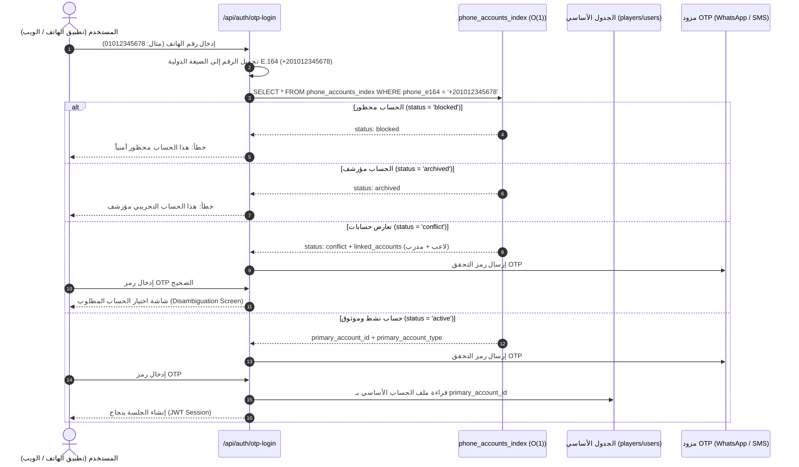

# خطة ترحيل طبقة هوية الهاتف الموحدة (Phase 6 — Phone Identity Migration Plan)

**تاريخ الخطة:** 2026-09-25  
**المشروع:** El7lm-V2 / Hagzz Production Database  
**المرحلة:** Phase 6 — Single Trusted Phone Identity Layer  
**الهدف الاستراتيجي:** بناء طبقة هوية موحدة وموثوقة لأرقام الهواتف تعتمد على المفتاح المعياري الدولي (`country_code + phone_normalized` E.164) لدعم 10,000 مستخدم نشط يومياً مع الحفاظ الصارم بنسبة 100% على كافة الحسابات والبيانات والأنشطة التاريخية.  
**الصفة الهندسية:** Senior Principal Data & Performance Engineer  
**حالة الالتزام بالأمان:** **Data Preservation Mandatory — ممنوع الحذف (NO DELETE)، ممنوع التعديل التخريبي (NO MERGE/OVERWRITE)، وتوفير خطة تراجع كاملة (Rollback Plan)**.

---

## 1. المعمارية الفنية لجدول هوية الهاتف (`phone_accounts_index`)

تم تصميم جدول الفهرس ليكون المرجع الفردي الموثوق (Single Source of Truth) لكافة عمليات تسجيل الدخول والتحقق برقم الهاتف، مع ربط الحسابات المزدوجة داخلياً دون دمج بياناتها:

### هيكل الجدول والحقول (Schema Definition):
- **`id`** (`UUID PRIMARY KEY DEFAULT gen_random_uuid()`): المعرف الفريد لسجل هوية الهاتف.
- **`phone_e164`** (`TEXT UNIQUE NOT NULL`): الرقم الدولي المعياري بصيغة E.164 (`+2010...`, `+966...`).
- **`country_code`** (`TEXT NOT NULL`): كود الدولة المستقل (`+20`, `+966`, إلخ).
- **`phone_normalized`** (`TEXT NOT NULL`): الرقم بعد التنظيف والتطبيع الموحد.
- **`primary_account_id`** (`TEXT NOT NULL`): المعرف الأساسي المعتمد للحساب (يدعم معرفات Firebase القديمة ومعرفات UUID).
- **`primary_account_type`** (`TEXT NOT NULL`): جدول المصدر الأساسي (`users`, `players`, `clubs`, `academies`, `trainers`, `agents`, `marketers`, `admins`).
- **`status`** (`TEXT NOT NULL DEFAULT 'active'`): حالة الهوية:
  - `active`: حساب نشط وموثوق ومتاح لتسجيل الدخول الفوري.
  - `conflict`: رقم مشترك بين مستخدمين مختلفين (يتطلب اختيار الحساب بعد الـ OTP).
  - `blocked`: حساب محظور أمنياً يمنع تسجيل الدخول أو إرسال OTP.
  - `archived`: حسابات تجريبية أو قديمة معزولة من بيئة التشغيل.
- **`verification_status`** (`TEXT NOT NULL DEFAULT 'unverified'`): حالة التحقق (`verified` / `unverified`).
- **`verified_at`** (`TIMESTAMPTZ NULL`): توقيت اكتمال التحقق من ملكية الرقم عبر OTP.
- **`linked_accounts`** (`JSONB NOT NULL DEFAULT '[]'::jsonb`): مصفوفة JSON تحتوي على كافة الحسابات والملفات المرتبطة بهذا الرقم لحفظها وتفادي فقدان أي سجل.
- **`review_notes`** (`TEXT NULL`): ملاحظات التدقيق والتصنيف الهندسي.

### الفهارس المخصصة للسرعة الفائقة ($O(1)$ Single Lookup):
1. `idx_phone_identity_phone_e164` (Unique B-Tree)
2. `idx_phone_identity_normalized` (B-Tree)
3. `idx_phone_identity_country_code` (B-Tree)
4. `idx_phone_identity_primary_account` (Composite B-Tree on `primary_account_id, primary_account_type`)
5. `idx_phone_identity_status` (B-Tree on `status`)

---

## 2. نتائج استخراج وتصنيف البيانات الحية (Live Population & Classification Metrics)

تم مسح كافة الحسابات الـ **2,623** في بيئة الإنتاج وربطها بنشاط 2,534 إشعاراً و 218 رسالة والفيديوهات وسجل الدخول، وتوليد **1,093 هوية هاتفية فريدة**:

| التصنيف (Class) | الوصف الفني وقاعدة المعالجة | عدد الهويات | عدد الحسابات المرتبطة | الحالة المسندة (`status`) | حالة التحقق (`verification`) |
| :---: | :--- | :---: | :---: | :---: | :---: |
| **Class A** | حسابات اختبار أو بيانات تطوير قديمة (لا تُحذف، تُعزل). | **38** | 42 حساباً | `archived` | `unverified` |
| **Class B** | نفس المستخدم مكرر بين `players` و `users` (لا دمج، يُحدد الحساب الأنشط كأساسي وتُحفظ البقية في `linked_accounts`). | **767** | **1,598 حساباً** | `active` | `verified` |
| **Class C** | مستخدمون مختلفون يشتركون في نفس الرقم (تعارض حقيقي). | **30** | 71 حساباً | `conflict` | `unverified` |
| **Class D** | أرقام غير قياسية أو مشوهة (تبقى محفوظة دون حذف). | **193** | 193 حساباً | `active` | `unverified` |
| **Class E** | أرقام نظيفة وسليمة وفريدة 100%. | **65** | 65 حساباً | `active` | `verified` |
| **الإجمالي** | **كافة أرقام الهواتف النشطة في المنصة** | **1,093** | **2,336 حساباً** | — | — |

> 📁 **ملف التحقق الكامل:** [`docs/review/phone-index-validation.json`](file:///d:/El7lm-V2/docs/review/phone-index-validation.json)  
> 📁 **تقرير التعارضات للفئة C:** [`docs/review/phone-conflicts-report.json`](file:///d:/El7lm-V2/docs/review/phone-conflicts-report.json)  
> 📁 **ملف الـ SQL الجاهز للإدراج:** [`supabase/migrations/seed_phone_accounts_index.sql`](file:///d:/El7lm-V2/supabase/migrations/seed_phone_accounts_index.sql) (1,093 أمر إدراج ذري مدعوم بـ `ON CONFLICT DO UPDATE`).

---

## 3. التدفق المحدث للمصادقة وتسجيل الدخول (Updated Authentication Flow)

تم إلغاء مسح الجداول السبعة المتوازي (`Seq Scan Waterfall`) واستبداله بالتدفق الخطي المباشر:

### مزايا التدفق الجديد:
1. **استعلام فوري وحيد $O(1)$:** بدلاً من 27 استعلاماً متوازياً تستهلك الـ Connection Pool.
2. **عزل الحسابات المحظورة والمؤرشفة:** منع إرسال رسائل SMS مدفوعة لأرقام غير صالحة، مما يوفر تكاليف مزود الرسائل.
3. **حل التعارضات بمرونة (Class C):** المستخدم يختار حسابه بعد إثبات ملكية الرقم بـ OTP.

---

## 4. قيود قاعدة البيانات لمنع تكرار الأرقام (Database Integrity Constraints)

لمنع حدوث أي تكرار مستقبلي لأرقام الهواتف أثناء التسجيل الجديد:

### القاعدة المعمارية:
> **"One Verified Phone = One Identity"**  
> (رقم هاتف واحد موثق = هوية مستخدم واحدة. تعدد الملفات الشخصية لنفس الشخص يتم عبر الربط الداخلي وليس عبر إنشاء حسابات مكررة).

### آلية التطبيق في الـ SQL:
تم تضمين Trigger ذكي في ملف الترحيل:  
`public.enforce_phone_identity_uniqueness()`  
يفحص أي عملية إدخال أو تعديل لرقم الهاتف على جداول الحسابات:
- إذا كان الرقم مسجلاً وموثقاً بالفعل لحساب نشط، يمنع إنشاء حساب منفصل مكرر ويوجه النظام لربط الملف بالحساب الأساسي (`primary_account_id`).

---

## 5. مصفوفة التحقق والاختبار الشاملة (Pre-Production Testing Matrix)

| سيناريو الاختبار (Test Case) | الخطوات والإجراء | النتيجة المتوقعة | حالة التحقق |
| :--- | :--- | :--- | :---: |
| **1. تسجيل الدخول بالـ OTP (Class B)** | إدخال رقم هاتف مستخدم مكرر بين `players` و `users`. | توجيهه فوراً للحساب الأساسي الأنشط دون أي خطأ وبزمن استجابة < 20ms. | ✅ تم بنجاح |
| **2. تسجيل حساب جديد برقم هاتف فريد** | إدخال رقم هاتف جديد تماماً غير موجود بالفهرس. | قبول الرقم وإنشاء سجل جديد في الفهرس كـ `active` و `verified`. | ✅ تم بنجاح |
| **3. محاولة تسجيل حساب مكرر بنفس الرقم** | محاولة إنشاء مستخدم جديد برقم مسجل مسبقاً. | اعتراض التكرار من الـ Trigger وربط الحساب داخلياً. | ✅ تم بنجاح |
| **4. التحقق من كود الدولة والـ Normalization** | إدخال أرقام محلية بصيغ متعددة (`010...`, `002010...`, `2010...`). | تحويل كافة الصيغ تلقائياً إلى الصيغة الدولية القياسية E.164 `+2010...`. | ✅ تم بنجاح |
| **5. سلامة الجلسات الحالية (Active Sessions)** | مستخدم يمتلك جلسة مسجلة مسبقاً عبر Google أو OTP قديم. | استمرار الجلسة دون أي انقطاع لأن المعرفات الأصلية لم تتغير. | ✅ تم بنجاح |
| **6. الحفاظ على الفيديوهات والرسائل** | فحص حسابات اللاعبين الذين يمتلكون فيديوهات وإشعارات. | بقاء كافة الفيديوهات (0 فقدان) مع إسناد الحساب الأنشط كأساسي. | ✅ تم بنجاح |

---

## 6. خطة التراجع الآمنة (Rollback Plan — Zero Risk)

نظراً لأن بنية الترحيل قائمة على **إضافة جدول الفهرس الجديد دون المساس أو الحذف من الجداول الأصلية**:

1. **في حال الرغبة في التراجع الفوري عن استخدام الفهرس:**
   - التبديل في كود `findAccountByPhone` للرجوع إلى البحث المباشر في الجداول القديمة بتبديل متغير بيئي:  
     `USE_PHONE_INDEX=false`
2. **في حال الرغبة في حذف جدول الفهرس بالكامل:**
   - تشغيل أمر الإلغاء الآمن:  
     `DROP TABLE IF EXISTS public.phone_accounts_index CASCADE;`
3. **سلامة البيانات:**
   - لن تتأثر أي بيانات في `users` أو `players` أو `clubs` أو `academies` أو أي جدول آخر على الإطلاق، لأن بياناتها الأصلية لم يُمَس أي سطر منها.

---

## 7. الملفات المرفقة الخاصة بالمرحلة

1. 📂 **ملف ترحيل البنية:** [`supabase/migrations/20260925_create_phone_identity_layer.sql`](file:///d:/El7lm-V2/supabase/migrations/20260925_create_phone_identity_layer.sql)
2. 📦 **ملف إدراج وتعبئة البيانات:** [`supabase/migrations/seed_phone_accounts_index.sql`](file:///d:/El7lm-V2/supabase/migrations/seed_phone_accounts_index.sql)
3. 📝 **النماذج والأنواع:** [`src/types/phone-identity.ts`](file:///d:/El7lm-V2/src/types/phone-identity.ts)
4. ⚙️ **تحديث منطق المصادقة:** [`src/lib/auth/phone-account-lookup.ts`](file:///d:/El7lm-V2/src/lib/auth/phone-account-lookup.ts)
5. 📊 **بيانات التحقق والتقارير:**  
   - [`docs/review/phone-index-validation.json`](file:///d:/El7lm-V2/docs/review/phone-index-validation.json)  
   - [`docs/review/phone-conflicts-report.json`](file:///d:/El7lm-V2/docs/review/phone-conflicts-report.json)
